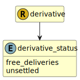

&lt;&nbsp; [Namespace](index.md)
#  fire.model.derivative_status
>  
>Provides additional information regarding the status of the derivative.
> 

## Local Fields

| Name        | Description |
| ----------- | ----------- |
| free_deliveries |   |
| unsettled |   |

 

### Referenced from fields in:
-  [fire.model.derivative](UDT-fire.model.derivative.md)
