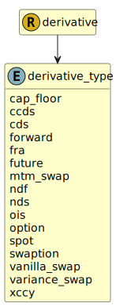

&lt;&nbsp; [Namespace](index.md)
#  fire.model.derivative_type
>  
>This is the type of the derivative with regards to common regulatory classifications.
> 

## Local Fields

| Name        | Description |
| ----------- | ----------- |
| cap_floor |   |
| ccds |   |
| cds |   |
| forward |   |
| fra |   |
| future |   |
| mtm_swap |   |
| ndf |   |
| nds |   |
| ois |   |
| option |   |
| spot |   |
| swaption |   |
| vanilla_swap |   |
| variance_swap |   |
| xccy |   |

 

### Referenced from fields in:
-  [fire.model.derivative](UDT-fire.model.derivative.md)
