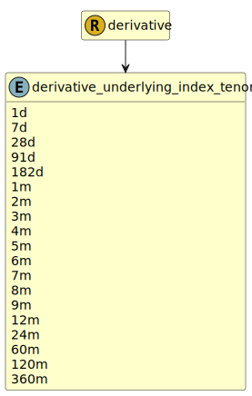

&lt;&nbsp; [Namespace](index.md)
#  fire.model.derivative_underlying_index_tenor
>  
>The designated maturity of the underlying interest rate index used in the underlying_index property for interest rate derivatives
> 

## Local Fields

| Name        | Description |
| ----------- | ----------- |
| 1d |   |
| 7d |   |
| 28d |   |
| 91d |   |
| 182d |   |
| 1m |   |
| 2m |   |
| 3m |   |
| 4m |   |
| 5m |   |
| 6m |   |
| 7m |   |
| 8m |   |
| 9m |   |
| 12m |   |
| 24m |   |
| 60m |   |
| 120m |   |
| 360m |   |

 

### Referenced from fields in:
-  [fire.model.derivative](UDT-fire.model.derivative.md)
