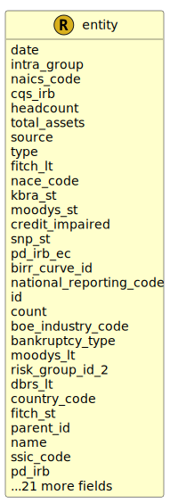

&lt;&nbsp; [Namespace](index.md)
#  fire.model.entity
>  
>Data schema to define a person or legal entity.
> 

## Local Fields

<table >
  <thead>
    <tr>
      <th>Name</th>
      <th>Datatype</th>
      <th>Description</th>
    </tr>
  </thead>
  <tbody>
    <tr>
        <td>date</td>
        <td>datetime</td>
        <td>
The observation or value date for the data in this object. Formatted as YYYY-MM-DDTHH:MM:SSZ in accordance with ISO 8601.

</td>
    </tr>
    <tr>
        <td>intra_group</td>
        <td><i>boolean</i> <b>?</b></td>
        <td>
Flag to indicate that this should be considered an intra-group entity.

</td>
    </tr>
    <tr>
        <td>naics_code</td>
        <td><i>int(10, 999999)</i> <b>?</b></td>
        <td>
North American Industry Classification System - NAICS Code

</td>
    </tr>
    <tr>
        <td>cqs_irb</td>
        <td><i>int(1, 12)</i> <b>?</b></td>
        <td>
The credit quality step for internal ratings based approach.

</td>
    </tr>
    <tr>
        <td>pd_irb</td>
        <td><i>double(0.0, 1.0)</i> <b>?</b></td>
        <td>
The probability of default as determined by internal rating-based methods, represented as a number between 0 and 1.

</td>
    </tr>
    <tr>
        <td>headcount</td>
        <td><i>int</i> <b>?</b></td>
        <td>
The number of full time staff.

</td>
    </tr>
    <tr>
        <td>total_assets</td>
        <td><i>int</i> <b>?</b></td>
        <td>
The annual balance sheet total of the entity as at the last accounting reference date.

</td>
    </tr>
    <tr>
        <td>risk_country_code</td>
        <td><i><a href='UDT-fire.model.country_code.html'>&nbsp;fire.model.country_code</a></i> <b>?</b></td>
        <td>
Two-letter country code describing where the risk for the security resides. In accordance with ISO 3166-1

</td>
    </tr>
    <tr>
        <td>internal_rating</td>
        <td><i><a href='UDT-fire.model.entity_internal_rating.html'>&nbsp;fire.model.entity_internal_rating</a></i> <b>?</b></td>
        <td>
Categorization of unrated exposure

</td>
    </tr>
    <tr>
        <td>dbrs_st</td>
        <td><i><a href='UDT-fire.model.entity_dbrs_st.html'>&nbsp;fire.model.entity_dbrs_st</a></i> <b>?</b></td>
        <td>
DBRS short term credit ratings

</td>
    </tr>
    <tr>
        <td>kbra_lt</td>
        <td><i><a href='UDT-fire.model.entity_kbra_lt.html'>&nbsp;fire.model.entity_kbra_lt</a></i> <b>?</b></td>
        <td>
KBRA long term credit ratings

</td>
    </tr>
    <tr>
        <td>scra</td>
        <td><i><a href='UDT-fire.model.entity_scra.html'>&nbsp;fire.model.entity_scra</a></i> <b>?</b></td>
        <td>
Grade calculated using the Basel Standardised Credit Risk Assessment

</td>
    </tr>
    <tr>
        <td>source</td>
        <td><i>string</i> <b>?</b></td>
        <td>
The source(s) where this data originated. If more than one source needs to be stored for data lineage, it should be separated by a dash. eg. Source1-Source2

</td>
    </tr>
    <tr>
        <td>type</td>
        <td><i><a href='UDT-fire.model.entity_type.html'>&nbsp;fire.model.entity_type</a></i> <b>?</b></td>
        <td>
The designated financial or legal entity category this person or legal entity falls under

</td>
    </tr>
    <tr>
        <td>fitch_lt</td>
        <td><i><a href='UDT-fire.model.entity_fitch_lt.html'>&nbsp;fire.model.entity_fitch_lt</a></i> <b>?</b></td>
        <td>
Fitch long term credit ratings

</td>
    </tr>
    <tr>
        <td>currency_code</td>
        <td><i><a href='UDT-fire.model.currency_code.html'>&nbsp;fire.model.currency_code</a></i> <b>?</b></td>
        <td>
Currency in accordance with ISO 4217. It should be consistent with the figures for turnover and total assets.

</td>
    </tr>
    <tr>
        <td>nace_code</td>
        <td><i><a href='UDT-fire.model.entity_nace_code.html'>&nbsp;fire.model.entity_nace_code</a></i> <b>?</b></td>
        <td>
The EU NACE economic activity classification.

</td>
    </tr>
    <tr>
        <td>kbra_st</td>
        <td><i><a href='UDT-fire.model.entity_kbra_st.html'>&nbsp;fire.model.entity_kbra_st</a></i> <b>?</b></td>
        <td>
KBRA short term credit ratings

</td>
    </tr>
    <tr>
        <td>moodys_st</td>
        <td><i><a href='UDT-fire.model.entity_moodys_st.html'>&nbsp;fire.model.entity_moodys_st</a></i> <b>?</b></td>
        <td>
Moodys short term credit ratings

</td>
    </tr>
    <tr>
        <td>credit_impaired</td>
        <td><i>boolean</i> <b>?</b></td>
        <td>
Flag to determine if the entity credit quality is impaired.

</td>
    </tr>
    <tr>
        <td>snp_st</td>
        <td><i><a href='UDT-fire.model.entity_snp_st.html'>&nbsp;fire.model.entity_snp_st</a></i> <b>?</b></td>
        <td>
S&amp;P short term credit ratings

</td>
    </tr>
    <tr>
        <td>lei_code</td>
        <td><i>string(20, 20)</i> <b>?</b></td>
        <td>
The LEI code for the legal entity (for corporates).

</td>
    </tr>
    <tr>
        <td>cqs_standardised</td>
        <td><i>int(1, 17)</i> <b>?</b></td>
        <td>
The credit quality step for standardised approach.

</td>
    </tr>
    <tr>
        <td>national_reporting_code</td>
        <td><i>string</i> <b>?</b></td>
        <td>
Unique identifier established by the national reporting system

</td>
    </tr>
    <tr>
        <td>id</td>
        <td>string</td>
        <td>
The unique identifier for the record within the firm.

</td>
    </tr>
    <tr>
        <td>relationship</td>
        <td><i><a href='UDT-fire.model.entity_relationship.html'>&nbsp;fire.model.entity_relationship</a></i> <b>?</b></td>
        <td>
Relationship to parent.

</td>
    </tr>
    <tr>
        <td>turnover</td>
        <td><i>int</i> <b>?</b></td>
        <td>
The annual turnover of the entity as at the last accounting reference date.

</td>
    </tr>
    <tr>
        <td>boe_sector_code</td>
        <td><i>string</i> <b>?</b></td>
        <td>
Bank of England sector code.

</td>
    </tr>
    <tr>
        <td>count</td>
        <td><i>int(1, *)</i> <b>?</b></td>
        <td>
Describes the number of entities represented by this record. eg. joint customers should have a count &gt; 1.

</td>
    </tr>
    <tr>
        <td>boe_industry_code</td>
        <td><i>string</i> <b>?</b></td>
        <td>
Bank of England industry code.

</td>
    </tr>
    <tr>
        <td>moodys_lt</td>
        <td><i><a href='UDT-fire.model.entity_moodys_lt.html'>&nbsp;fire.model.entity_moodys_lt</a></i> <b>?</b></td>
        <td>
Moody's long term credit ratings

</td>
    </tr>
    <tr>
        <td>version_id</td>
        <td><i>string</i> <b>?</b></td>
        <td>
The version identifier of the data such as the firm's internal batch identifier.

</td>
    </tr>
    <tr>
        <td>risk_group_id_2</td>
        <td><i>string</i> <b>?</b></td>
        <td>
The secondary identifier for the secondary group representing a single risk entity where no relationship of control exists

</td>
    </tr>
    <tr>
        <td>snp_lt</td>
        <td><i><a href='UDT-fire.model.entity_snp_lt.html'>&nbsp;fire.model.entity_snp_lt</a></i> <b>?</b></td>
        <td>
S&amp;P long term credit ratings

</td>
    </tr>
    <tr>
        <td>dbrs_lt</td>
        <td><i><a href='UDT-fire.model.entity_dbrs_lt.html'>&nbsp;fire.model.entity_dbrs_lt</a></i> <b>?</b></td>
        <td>
DBRS long term credit ratings

</td>
    </tr>
    <tr>
        <td>address_city</td>
        <td><i>string</i> <b>?</b></td>
        <td>
City, town or village.

</td>
    </tr>
    <tr>
        <td>country_code</td>
        <td><i><a href='UDT-fire.model.country_code.html'>&nbsp;fire.model.country_code</a></i> <b>?</b></td>
        <td>
The person or entity country of residence. Two-letter country code as defined according to ISO 3166-1.

</td>
    </tr>
    <tr>
        <td>lgd_irb</td>
        <td><i>double(0.0, 1.0)</i> <b>?</b></td>
        <td>
The loss given default as determined by internal rating-based methods, represented as a number between 0 and 1.

</td>
    </tr>
    <tr>
        <td>sic_code</td>
        <td><i>int(0, 99999)</i> <b>?</b></td>
        <td>
The UK SIC 2007 standard industry and sector classification.

</td>
    </tr>
    <tr>
        <td>fitch_st</td>
        <td><i><a href='UDT-fire.model.entity_fitch_st.html'>&nbsp;fire.model.entity_fitch_st</a></i> <b>?</b></td>
        <td>
Fitch short term credit ratings

</td>
    </tr>
    <tr>
        <td>parent_id</td>
        <td><i>string</i> <b>?</b></td>
        <td>
The unique identifier for the ultimate parent of the person or legal entity.

</td>
    </tr>
    <tr>
        <td>reporting_relationship</td>
        <td><i><a href='UDT-fire.model.entity_reporting_relationship.html'>&nbsp;fire.model.entity_reporting_relationship</a></i> <b>?</b></td>
        <td>
Relationship to reporting entity. See: relationship.

</td>
    </tr>
    <tr>
        <td>name</td>
        <td><i>string</i> <b>?</b></td>
        <td>
The name of the person or legal entity to be used for display and reference purposes.

</td>
    </tr>
    <tr>
        <td>risk_group_id</td>
        <td><i>string</i> <b>?</b></td>
        <td>
The unique identifier for the group representing a single risk entity where no relationship of control exists

</td>
    </tr>
    <tr>
        <td>legal_entity_name</td>
        <td><i>string</i> <b>?</b></td>
        <td>
The official legal name of the entity.

</td>
    </tr>
    <tr>
        <td>ssic_code</td>
        <td><i>int(0, 99999)</i> <b>?</b></td>
        <td>
The Singaporean standard industry and sector classification.

</td>
    </tr>

  </tbody>
</table>
      
