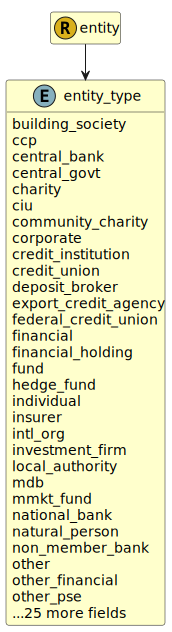

&lt;&nbsp; [Namespace](index.md)
#  fire.model.entity_type
>  
>The designated financial or legal entity category this person or legal entity falls under
> 

## Local Fields

| Name        | Description |
| ----------- | ----------- |
| building_society |   |
| ccp |   |
| central_bank |   |
| central_govt |   |
| charity |   |
| ciu |   |
| community_charity |   |
| corporate |   |
| credit_institution |   |
| credit_union |   |
| deposit_broker |   |
| export_credit_agency |   |
| federal_credit_union |   |
| financial |   |
| financial_holding |   |
| fund |   |
| hedge_fund |   |
| individual |   |
| insurer |   |
| intl_org |   |
| investment_firm |   |
| local_authority |   |
| mdb |   |
| mmkt_fund |   |
| national_bank |   |
| natural_person |   |
| non_member_bank |   |
| other |   |
| other_financial |   |
| other_pse |   |
| partnership |   |
| pension_fund |   |
| pic |   |
| pmi |   |
| private_equity_fund |   |
| private_fund |   |
| promo_fed_home_loan |   |
| promo_fed_reserve |   |
| promotional_lender |   |
| pse |   |
| public_corporation |   |
| qccp |   |
| real_estate_fund |   |
| regional_govt |   |
| sme |   |
| social_security_fund |   |
| sovereign |   |
| sspe |   |
| state_credit_union |   |
| state_member_bank |   |
| state_owned_bank |   |
| statutory_board |   |
| supported_sme |   |
| unincorporated_biz |   |
| unregulated_financial |   |

 

### Referenced from fields in:
-  [fire.model.entity](UDT-fire.model.entity.md)
