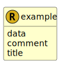

&lt;&nbsp; [Namespace](index.md)
#  fire.model.example
>  
>FIRE schema for representing and validating FIRE examples
> 

## Local Fields

<table >
  <thead>
    <tr>
      <th>Name</th>
      <th>Datatype</th>
      <th>Description</th>
    </tr>
  </thead>
  <tbody>
    <tr>
        <td>data</td>
        <td><a href='UDT-fire.model.example_data.html'>&nbsp;fire.model.example_data</a></td>
        <td>
An object of FIRE data lists, with data types as keys

</td>
    </tr>
    <tr>
        <td>comment</td>
        <td>string</td>
        <td>
Additional comments describing the FIRE example

</td>
    </tr>
    <tr>
        <td>title</td>
        <td>string</td>
        <td>
Title of the FIRE product example

</td>
    </tr>

  </tbody>
</table>
      
