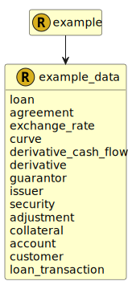

&lt;&nbsp; [Namespace](index.md)
#  fire.model.example_data

## Local Fields

<table >
  <thead>
    <tr>
      <th>Name</th>
      <th>Datatype</th>
      <th>Description</th>
    </tr>
  </thead>
  <tbody>
    <tr>
        <td>loan</td>
        <td><i>set< <a href='UDT-fire.model.loan.html'>&nbsp;fire.model.loan</a> ></i> <b>?</b></td>
        <td></td>
    </tr>
    <tr>
        <td>agreement</td>
        <td><i>set< <a href='UDT-fire.model.agreement.html'>&nbsp;fire.model.agreement</a> ></i> <b>?</b></td>
        <td></td>
    </tr>
    <tr>
        <td>exchange_rate</td>
        <td><i>set< <a href='UDT-fire.model.exchange_rate.html'>&nbsp;fire.model.exchange_rate</a> ></i> <b>?</b></td>
        <td></td>
    </tr>
    <tr>
        <td>curve</td>
        <td><i>set< <a href='UDT-fire.model.curve.html'>&nbsp;fire.model.curve</a> ></i> <b>?</b></td>
        <td></td>
    </tr>
    <tr>
        <td>derivative_cash_flow</td>
        <td><i>set< <a href='UDT-fire.model.derivative_cash_flow.html'>&nbsp;fire.model.derivative_cash_flow</a> ></i> <b>?</b></td>
        <td></td>
    </tr>
    <tr>
        <td>derivative</td>
        <td><i>set< <a href='UDT-fire.model.derivative.html'>&nbsp;fire.model.derivative</a> ></i> <b>?</b></td>
        <td></td>
    </tr>
    <tr>
        <td>guarantor</td>
        <td><i>set< <a href='UDT-fire.model.guarantor.html'>&nbsp;fire.model.guarantor</a> ></i> <b>?</b></td>
        <td></td>
    </tr>
    <tr>
        <td>issuer</td>
        <td><i>set< <a href='UDT-fire.model.issuer.html'>&nbsp;fire.model.issuer</a> ></i> <b>?</b></td>
        <td></td>
    </tr>
    <tr>
        <td>security</td>
        <td><i>set< <a href='UDT-fire.model.security.html'>&nbsp;fire.model.security</a> ></i> <b>?</b></td>
        <td></td>
    </tr>
    <tr>
        <td>adjustment</td>
        <td><i>set< <a href='UDT-fire.model.adjustment.html'>&nbsp;fire.model.adjustment</a> ></i> <b>?</b></td>
        <td></td>
    </tr>
    <tr>
        <td>collateral</td>
        <td><i>set< <a href='UDT-fire.model.collateral.html'>&nbsp;fire.model.collateral</a> ></i> <b>?</b></td>
        <td></td>
    </tr>
    <tr>
        <td>account</td>
        <td><i>set< <a href='UDT-fire.model.account.html'>&nbsp;fire.model.account</a> ></i> <b>?</b></td>
        <td></td>
    </tr>
    <tr>
        <td>customer</td>
        <td><i>set< <a href='UDT-fire.model.customer.html'>&nbsp;fire.model.customer</a> ></i> <b>?</b></td>
        <td></td>
    </tr>
    <tr>
        <td>loan_transaction</td>
        <td><i>set< <a href='UDT-fire.model.loan_transaction.html'>&nbsp;fire.model.loan_transaction</a> ></i> <b>?</b></td>
        <td></td>
    </tr>

  </tbody>
</table>
      

 

### Referenced from fields in:
-  [fire.model.example](UDT-fire.model.example.md)
