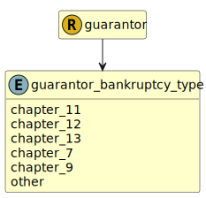

&lt;&nbsp; [Namespace](index.md)
#  fire.model.guarantor_bankruptcy_type
>  
>The bankruptcy chapter of the borrower.
> 

## Local Fields

| Name        | Description |
| ----------- | ----------- |
| chapter_11 |   |
| chapter_12 |   |
| chapter_13 |   |
| chapter_7 |   |
| chapter_9 |   |
| other |   |

 

### Referenced from fields in:
-  [fire.model.guarantor](UDT-fire.model.guarantor.md)
