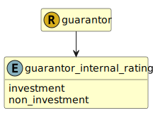

&lt;&nbsp; [Namespace](index.md)
#  fire.model.guarantor_internal_rating
>  
>Categorization of unrated exposure
> 

## Local Fields

| Name        | Description |
| ----------- | ----------- |
| investment |   |
| non_investment |   |

 

### Referenced from fields in:
-  [fire.model.guarantor](UDT-fire.model.guarantor.md)
