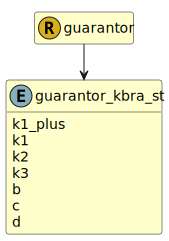

&lt;&nbsp; [Namespace](index.md)
#  fire.model.guarantor_kbra_st
>  
>KBRA short term credit ratings
> 

## Local Fields

| Name        | Description |
| ----------- | ----------- |
| k1_plus |   |
| k1 |   |
| k2 |   |
| k3 |   |
| b |   |
| c |   |
| d |   |

 

### Referenced from fields in:
-  [fire.model.guarantor](UDT-fire.model.guarantor.md)
