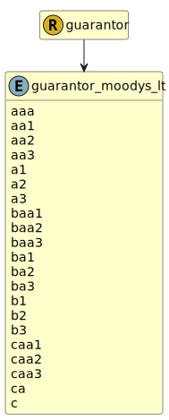

&lt;&nbsp; [Namespace](index.md)
#  fire.model.guarantor_moodys_lt
>  
>Moody's long term credit ratings
> 

## Local Fields

| Name        | Description |
| ----------- | ----------- |
| aaa |   |
| aa1 |   |
| aa2 |   |
| aa3 |   |
| a1 |   |
| a2 |   |
| a3 |   |
| baa1 |   |
| baa2 |   |
| baa3 |   |
| ba1 |   |
| ba2 |   |
| ba3 |   |
| b1 |   |
| b2 |   |
| b3 |   |
| caa1 |   |
| caa2 |   |
| caa3 |   |
| ca |   |
| c |   |

 

### Referenced from fields in:
-  [fire.model.guarantor](UDT-fire.model.guarantor.md)
