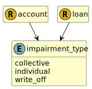

&lt;&nbsp; [Namespace](index.md)
#  fire.model.impairment_type
>  
>The loss event resulting in the impairment of the loan.
> 

## Local Fields

| Name        | Description |
| ----------- | ----------- |
| collective |   |
| individual |   |
| write_off |   |

 

### Referenced from fields in:
-  [fire.model.account](UDT-fire.model.account.md)
-  [fire.model.loan](UDT-fire.model.loan.md)
