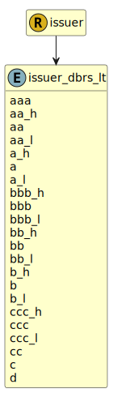

&lt;&nbsp; [Namespace](index.md)
#  fire.model.issuer_dbrs_lt
>  
>DBRS long term credit ratings
> 

## Local Fields

| Name        | Description |
| ----------- | ----------- |
| aaa |   |
| aa_h |   |
| aa |   |
| aa_l |   |
| a_h |   |
| a |   |
| a_l |   |
| bbb_h |   |
| bbb |   |
| bbb_l |   |
| bb_h |   |
| bb |   |
| bb_l |   |
| b_h |   |
| b |   |
| b_l |   |
| ccc_h |   |
| ccc |   |
| ccc_l |   |
| cc |   |
| c |   |
| d |   |

 

### Referenced from fields in:
-  [fire.model.issuer](UDT-fire.model.issuer.md)
