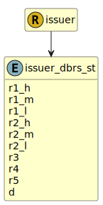

&lt;&nbsp; [Namespace](index.md)
#  fire.model.issuer_dbrs_st
>  
>DBRS short term credit ratings
> 

## Local Fields

| Name        | Description |
| ----------- | ----------- |
| r1_h |   |
| r1_m |   |
| r1_l |   |
| r2_h |   |
| r2_m |   |
| r2_l |   |
| r3 |   |
| r4 |   |
| r5 |   |
| d |   |

 

### Referenced from fields in:
-  [fire.model.issuer](UDT-fire.model.issuer.md)
