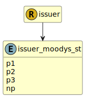

&lt;&nbsp; [Namespace](index.md)
#  fire.model.issuer_moodys_st
>  
>Moodys short term credit ratings
> 

## Local Fields

| Name        | Description |
| ----------- | ----------- |
| p1 |   |
| p2 |   |
| p3 |   |
| np |   |

 

### Referenced from fields in:
-  [fire.model.issuer](UDT-fire.model.issuer.md)
