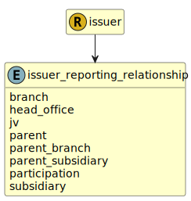

&lt;&nbsp; [Namespace](index.md)
#  fire.model.issuer_reporting_relationship
>  
>Relationship to reporting entity. See: relationship.
> 

## Local Fields

| Name        | Description |
| ----------- | ----------- |
| branch |   |
| head_office |   |
| jv |   |
| parent |   |
| parent_branch |   |
| parent_subsidiary |   |
| participation |   |
| subsidiary |   |

 

### Referenced from fields in:
-  [fire.model.issuer](UDT-fire.model.issuer.md)
