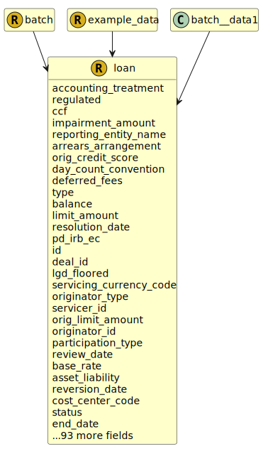

&lt;&nbsp; [Namespace](index.md)
#  fire.model.loan
>  
>Data schema defining the characteristics of a loan product.
> 

## Local Fields

<table >
  <thead>
    <tr>
      <th>Name</th>
      <th>Datatype</th>
      <th>Description</th>
    </tr>
  </thead>
  <tbody>
    <tr>
        <td>accounting_treatment</td>
        <td><i><a href='UDT-fire.model.accounting_treatment.html'>&nbsp;fire.model.accounting_treatment</a></i> <b>?</b></td>
        <td></td>
    </tr>
    <tr>
        <td>regulated</td>
        <td><i>boolean</i> <b>?</b></td>
        <td>
Is this loan regulated or unregulated?

</td>
    </tr>
    <tr>
        <td>ccf</td>
        <td><i>double(0.0, *)</i> <b>?</b></td>
        <td></td>
    </tr>
    <tr>
        <td>impairment_amount</td>
        <td><i>int(0, *)</i> <b>?</b></td>
        <td>
The impairment amount for a loan is the allowance for loan impairments set aside by the firm that accounts for the event that the loan becomes impaired in the future.

</td>
    </tr>
    <tr>
        <td>reporting_entity_name</td>
        <td><i>string</i> <b>?</b></td>
        <td>
The name of the reporting legal entity for display purposes.

</td>
    </tr>
    <tr>
        <td>arrears_arrangement</td>
        <td><i><a href='UDT-fire.model.loan_arrears_arrangement.html'>&nbsp;fire.model.loan_arrears_arrangement</a></i> <b>?</b></td>
        <td>
The arrangement the lender has made with the borrower regarding the amount referenced in the arrears_balance.

</td>
    </tr>
    <tr>
        <td>orig_credit_score</td>
        <td><i>int</i> <b>?</b></td>
        <td>
The credit score of the customer at origination of the product using a commercially available credit bureau score.

</td>
    </tr>
    <tr>
        <td>day_count_convention</td>
        <td><i><a href='UDT-fire.model.day_count_convention.html'>&nbsp;fire.model.day_count_convention</a></i> <b>?</b></td>
        <td>
The standardised methodology for calculating the number of days between two dates. It is used to calculate the amount of accrued interest or the present value.

</td>
    </tr>
    <tr>
        <td>deferred_fees</td>
        <td><i>int</i> <b>?</b></td>
        <td>
Deferred fees are deferred payments subject to prepayment risk and not included in the balance.

</td>
    </tr>
    <tr>
        <td>type</td>
        <td><i><a href='UDT-fire.model.loan_type.html'>&nbsp;fire.model.loan_type</a></i> <b>?</b></td>
        <td>
The form of the loan product administered by the financial institution, with regards to common regulatory classifications.

</td>
    </tr>
    <tr>
        <td>balance</td>
        <td><i>int</i> <b>?</b></td>
        <td>
The balance of the loan or capital still to be repaid. Monetary type represented as a naturally positive integer number of cents/pence.

</td>
    </tr>
    <tr>
        <td>limit_amount</td>
        <td><i>int(0, *)</i> <b>?</b></td>
        <td>
The total credit limit on the loan. Monetary type represented as a naturally positive integer number of cents/pence.

</td>
    </tr>
    <tr>
        <td>resolution_date</td>
        <td><i>datetime</i> <b>?</b></td>
        <td>
Date of resolution of the defaulted facility.

</td>
    </tr>
    <tr>
        <td>pd_irb_ec</td>
        <td><i>double(0.0, 1.0)</i> <b>?</b></td>
        <td>
The probability of default as determined by internal ratings-based approach. Expressed as a percentage between 0 and 1. This value is used in economic capital calculations.

</td>
    </tr>
    <tr>
        <td>id</td>
        <td>string</td>
        <td>
The unique identifier for the record within the firm.

</td>
    </tr>
    <tr>
        <td>deal_id</td>
        <td><i>string</i> <b>?</b></td>
        <td>
Identifier used for linking this product as part of a larger deal. e.g. Two components of a single loan or matching a securitisation with it's underlying loan.

</td>
    </tr>
    <tr>
        <td>lgd_floored</td>
        <td><i>double(0.0, 1.0)</i> <b>?</b></td>
        <td>
The final LGD value after the relevant floors have been applied. To be used in the IRB RWA calculations

</td>
    </tr>
    <tr>
        <td>servicing_currency_code</td>
        <td><i><a href='UDT-fire.model.currency_code.html'>&nbsp;fire.model.currency_code</a></i> <b>?</b></td>
        <td>
Identify the currency in which a loan shall be repaid.

</td>
    </tr>
    <tr>
        <td>originator_type</td>
        <td><i><a href='UDT-fire.model.loan_originator_type.html'>&nbsp;fire.model.loan_originator_type</a></i> <b>?</b></td>
        <td>
The type of financial institution that acted as the originator of the loan product.

</td>
    </tr>
    <tr>
        <td>servicer_id</td>
        <td><i>string</i> <b>?</b></td>
        <td>
This is the unique id to identify the servicer of a loan.

</td>
    </tr>
    <tr>
        <td>orig_limit_amount</td>
        <td><i>int</i> <b>?</b></td>
        <td>
The original line of credit amount that was granted at the origination of the facility

</td>
    </tr>
    <tr>
        <td>originator_id</td>
        <td><i>string</i> <b>?</b></td>
        <td>
The unique identifier used by the financial institution to identify the originator of the loan product.

</td>
    </tr>
    <tr>
        <td>participation_type</td>
        <td><i><a href='UDT-fire.model.loan_participation_type.html'>&nbsp;fire.model.loan_participation_type</a></i> <b>?</b></td>
        <td>
For participated or syndicated credit facilities that have closed and settled, indicates the type of participation in the loan. Refer to https://www.federalreserve.gov/apps/reportingforms/Report/Index/FR_Y-14Q for more information.

</td>
    </tr>
    <tr>
        <td>review_date</td>
        <td><i>datetime</i> <b>?</b></td>
        <td>
The currently scheduled review date for Counterparty exposure. This date should be set in the future. Formatted as YYYY-MM-DDTHH:MM:SSZ in accordance with ISO 8601.

</td>
    </tr>
    <tr>
        <td>base_rate</td>
        <td><i><a href='UDT-fire.model.loan_base_rate.html'>&nbsp;fire.model.loan_base_rate</a></i> <b>?</b></td>
        <td>
The base rate represents the basis of the repayment rate on the borrowed funds at the given date as agreed in the terms of the loan.

</td>
    </tr>
    <tr>
        <td>asset_liability</td>
        <td><i><a href='UDT-fire.model.asset_liability.html'>&nbsp;fire.model.asset_liability</a></i> <b>?</b></td>
        <td></td>
    </tr>
    <tr>
        <td>reversion_date</td>
        <td><i>datetime</i> <b>?</b></td>
        <td>
The timestamp that indicates the end of an initial period where the 'rate' is applied to a loan. After this the interest is calculated using the 'reversion_rate'. YYYY-MM-DDTHH:MM:SSZ in accordance with ISO 8601.

</td>
    </tr>
    <tr>
        <td>cost_center_code</td>
        <td><i>string</i> <b>?</b></td>
        <td>
The organizational unit or sub-unit to which costs/profits are booked.

</td>
    </tr>
    <tr>
        <td>status</td>
        <td><i><a href='UDT-fire.model.loan_status.html'>&nbsp;fire.model.loan_status</a></i> <b>?</b></td>
        <td>
Describes if the loan is active or been cancelled.

</td>
    </tr>
    <tr>
        <td>end_date</td>
        <td><i>datetime</i> <b>?</b></td>
        <td>
YYYY-MM-DDTHH:MM:SSZ in accordance with ISO 8601

</td>
    </tr>
    <tr>
        <td>pd_irb</td>
        <td><i>double(0.0, 1.0)</i> <b>?</b></td>
        <td>
The probability of default as determined by internal rating-based methods. Percentage between 0 and 1.

</td>
    </tr>
    <tr>
        <td>fraud_loss</td>
        <td><i>int</i> <b>?</b></td>
        <td>
The total value of accounting losses incurred by the Financial Institution due to fraudulent activities within the reporting segment.

</td>
    </tr>
    <tr>
        <td>ead</td>
        <td><i>int</i> <b>?</b></td>
        <td>
The EAD field allows users to input monetary exposure-at-default values across the loan's lifecycle. Upon default, this field must be updated to reflect the final realised EAD value — that is, the actual exposure outstanding at the moment of default.

</td>
    </tr>
    <tr>
        <td>encumbrance_type</td>
        <td><i><a href='UDT-fire.model.loan_encumbrance_type.html'>&nbsp;fire.model.loan_encumbrance_type</a></i> <b>?</b></td>
        <td>
The type of the encumbrance causing the encumbrance_amount.

</td>
    </tr>
    <tr>
        <td>interest_repayment_frequency</td>
        <td><i><a href='UDT-fire.model.loan_interest_repayment_frequency.html'>&nbsp;fire.model.loan_interest_repayment_frequency</a></i> <b>?</b></td>
        <td>
Repayment frequency of the loan interest, if different from principal.

</td>
    </tr>
    <tr>
        <td>notional_amount</td>
        <td><i>int</i> <b>?</b></td>
        <td>
The original notional amount of the loan. Monetary type represented as a naturally positive integer number of cents/pence.

</td>
    </tr>
    <tr>
        <td>regulatory_book</td>
        <td><i><a href='UDT-fire.model.regulatory_book.html'>&nbsp;fire.model.regulatory_book</a></i> <b>?</b></td>
        <td></td>
    </tr>
    <tr>
        <td>risk_weight_irb</td>
        <td><i>double</i> <b>?</b></td>
        <td>
The internal risk weight represented as a decimal/float such that 1.5% is 0.015.

</td>
    </tr>
    <tr>
        <td>currency_code</td>
        <td><i><a href='UDT-fire.model.currency_code.html'>&nbsp;fire.model.currency_code</a></i> <b>?</b></td>
        <td></td>
    </tr>
    <tr>
        <td>repayment_type</td>
        <td><i><a href='UDT-fire.model.loan_repayment_type.html'>&nbsp;fire.model.loan_repayment_type</a></i> <b>?</b></td>
        <td>
Repayment type of the loan refers to whether the customer will be repaying capital + interest, just interest or a combination of the two.

</td>
    </tr>
    <tr>
        <td>minimum_balance</td>
        <td><i>int</i> <b>?</b></td>
        <td>
Indicates the minimum balance of each loan within the aggregate.

</td>
    </tr>
    <tr>
        <td>on_balance_sheet</td>
        <td><i>boolean</i> <b>?</b></td>
        <td>
Is the loan reported on the balance sheet of the financial institution?

</td>
    </tr>
    <tr>
        <td>orig_notional</td>
        <td><i>int</i> <b>?</b></td>
        <td>
The notional of the loan at origination.

</td>
    </tr>
    <tr>
        <td>cr_approach</td>
        <td><i><a href='UDT-fire.model.cr_approach.html'>&nbsp;fire.model.cr_approach</a></i> <b>?</b></td>
        <td>
Specifies the approved credit risk rwa calculation approach to be applied to the exposure.

</td>
    </tr>
    <tr>
        <td>economic_loss</td>
        <td><i>int</i> <b>?</b></td>
        <td>
The definition of loss, used in estimating Loss Given Default for the reporting segment. When measuring economic loss, as opposed to accounting loss

</td>
    </tr>
    <tr>
        <td>forbearance_date</td>
        <td><i>datetime</i> <b>?</b></td>
        <td>
The date on which the first forbearance measure was granted to this product.  Format should be YYYY-MM-DDTHH:MM:SSZ in accordance with ISO 8601

</td>
    </tr>
    <tr>
        <td>customers</td>
        <td><i>set< <a href='UDT-fire.model.loan_customers.html'>&nbsp;fire.model.loan_customers</a> ></i> <b>?</b></td>
        <td>
The list of customers for this loan

</td>
    </tr>
    <tr>
        <td>frr_id</td>
        <td><i>string</i> <b>?</b></td>
        <td>
The internal facility risk rating assigned to a facility based on its specific risk characteristics, including collateral and seniority.

</td>
    </tr>
    <tr>
        <td>servicing</td>
        <td><i><a href='UDT-fire.model.loan_servicing.html'>&nbsp;fire.model.loan_servicing</a></i> <b>?</b></td>
        <td>
The method by which the loan shall be repaid

</td>
    </tr>
    <tr>
        <td>start_date</td>
        <td><i>datetime</i> <b>?</b></td>
        <td>
The timestamp that the trade or financial product commences. YYYY-MM-DDTHH:MM:SSZ in accordance with ISO 8601.

</td>
    </tr>
    <tr>
        <td>provision_type</td>
        <td><i><a href='UDT-fire.model.loan_provision_type.html'>&nbsp;fire.model.loan_provision_type</a></i> <b>?</b></td>
        <td>
The provision type parameter details the provisions the issuing firm has allocated to cover potential losses from issuing a loan.

</td>
    </tr>
    <tr>
        <td>accrued_interest_12m</td>
        <td><i>int</i> <b>?</b></td>
        <td>
The cumulative accrued interest over the past 12 months. Monetary type represented as a naturally positive integer number of cents/pence.

</td>
    </tr>
    <tr>
        <td>last_arrears_date</td>
        <td><i>datetime</i> <b>?</b></td>
        <td>
The last date on which this loan was in arrears.

</td>
    </tr>
    <tr>
        <td>behavioral_end_date</td>
        <td><i>datetime</i> <b>?</b></td>
        <td>
Behavioral end date (as opposed to contractual). YYYY-MM-DDTHH:MM:SSZ in accordance with ISO 8601

</td>
    </tr>
    <tr>
        <td>provision_amount</td>
        <td><i>int(0, *)</i> <b>?</b></td>
        <td>
The amount of reserves that is provisioned by the financial institution to cover the potential loss on the loan. Monetary type represented as a naturally positive integer number of cents/pence.

</td>
    </tr>
    <tr>
        <td>impairment_date</td>
        <td><i>datetime</i> <b>?</b></td>
        <td>
The date upon which the product became considered impaired. Format should be YYYY-MM-DDTHH:MM:SSZ in accordance with ISO 8601

</td>
    </tr>
    <tr>
        <td>ref_income_amount</td>
        <td><i>int(0, *)</i> <b>?</b></td>
        <td>
The reference income used for the customer(s) for this loan. Monetary type represented as an integer number of cents/pence.

</td>
    </tr>
    <tr>
        <td>trade_date</td>
        <td><i>datetime</i> <b>?</b></td>
        <td>
The timestamp that the trade or financial product terms are agreed. YYYY-MM-DDTHH:MM:SSZ in accordance with ISO 8601.

</td>
    </tr>
    <tr>
        <td>issuer_id</td>
        <td><i>string(*, 20)</i> <b>?</b></td>
        <td>
The unique identifier for the issuer of the loan.

</td>
    </tr>
    <tr>
        <td>lgd_irb_ec</td>
        <td><i>double(0.0, 1.0)</i> <b>?</b></td>
        <td>
The loss given default as determined by internal ratings-based approach. Expressed as a percentage between 0 and 1. This value is used in economic capital calculations.

</td>
    </tr>
    <tr>
        <td>cb_haircut</td>
        <td><i>double(0.0, 1.0)</i> <b>?</b></td>
        <td>
The haircut as determined by the firm's central bank

</td>
    </tr>
    <tr>
        <td>repayment_frequency</td>
        <td><i><a href='UDT-fire.model.loan_repayment_frequency.html'>&nbsp;fire.model.loan_repayment_frequency</a></i> <b>?</b></td>
        <td>
Repayment frequency of the loan.

</td>
    </tr>
    <tr>
        <td>first_arrears_date</td>
        <td><i>datetime</i> <b>?</b></td>
        <td>
The first date on which this loan was in arrears.

</td>
    </tr>
    <tr>
        <td>income_assessment</td>
        <td><i><a href='UDT-fire.model.loan_income_assessment.html'>&nbsp;fire.model.loan_income_assessment</a></i> <b>?</b></td>
        <td>
Was the loan assessed against a single or joint incomes?

</td>
    </tr>
    <tr>
        <td>accrual_status</td>
        <td><i><a href='UDT-fire.model.loan_accrual_status.html'>&nbsp;fire.model.loan_accrual_status</a></i> <b>?</b></td>
        <td>
The accrual status of the loan or line of credit.

</td>
    </tr>
    <tr>
        <td>repurchase_status</td>
        <td><i><a href='UDT-fire.model.loan_repurchase_status.html'>&nbsp;fire.model.loan_repurchase_status</a></i> <b>?</b></td>
        <td>
The current status of the repurchase of the loan.

</td>
    </tr>
    <tr>
        <td>customer_id</td>
        <td><i>string</i> <b>?</b></td>
        <td>
The unique identifier used by the financial institution to identify the customer.

</td>
    </tr>
    <tr>
        <td>lgd_downturn</td>
        <td><i>double(0.0, 1.0)</i> <b>?</b></td>
        <td>
The loss given default in the event of an economic downturn. Percentage between 0 and 1.

</td>
    </tr>
    <tr>
        <td>movement</td>
        <td><i><a href='UDT-fire.model.loan_movement.html'>&nbsp;fire.model.loan_movement</a></i> <b>?</b></td>
        <td>
The movement parameter describes how the loan arrived to the firm.

</td>
    </tr>
    <tr>
        <td>seniority</td>
        <td><i><a href='UDT-fire.model.loan_seniority.html'>&nbsp;fire.model.loan_seniority</a></i> <b>?</b></td>
        <td>
The seniority of the security in the event of sale or bankruptcy of the issuer.

</td>
    </tr>
    <tr>
        <td>date</td>
        <td>datetime</td>
        <td>
The observation or value date for the data in this object. Formatted as YYYY-MM-DDTHH:MM:SSZ in accordance with ISO 8601.

</td>
    </tr>
    <tr>
        <td>fees</td>
        <td><i>int</i> <b>?</b></td>
        <td>
The fees associated with the loan.

</td>
    </tr>
    <tr>
        <td>last_recovery_date</td>
        <td><i>datetime</i> <b>?</b></td>
        <td>
Date of most recent recovery in the reporting quarter.

</td>
    </tr>
    <tr>
        <td>risk_weight_std</td>
        <td><i>double</i> <b>?</b></td>
        <td>
The standardised approach risk weight represented as a decimal/float such that 1.5% is 0.015.

</td>
    </tr>
    <tr>
        <td>impairment_status</td>
        <td><i><a href='UDT-fire.model.impairment_status.html'>&nbsp;fire.model.impairment_status</a></i> <b>?</b></td>
        <td></td>
    </tr>
    <tr>
        <td>administration</td>
        <td><i><a href='UDT-fire.model.loan_administration.html'>&nbsp;fire.model.loan_administration</a></i> <b>?</b></td>
        <td>
How the loan was administered by the lender.

</td>
    </tr>
    <tr>
        <td>source</td>
        <td><i>string</i> <b>?</b></td>
        <td>
The source(s) where this data originated. If more than one source needs to be stored for data lineage, it should be separated by a dash. eg. Source1-Source2

</td>
    </tr>
    <tr>
        <td>cum_recoveries</td>
        <td><i>int(0, *)</i> <b>?</b></td>
        <td>
The total amount recovered since the date of default of the instrument.

</td>
    </tr>
    <tr>
        <td>pd_retail_irb</td>
        <td><i>double(0.0, 1.0)</i> <b>?</b></td>
        <td>
The retail probability of default as determined by internal rating-based methods. Percentage between 0 and 1.

</td>
    </tr>
    <tr>
        <td>arrears_balance</td>
        <td><i>int</i> <b>?</b></td>
        <td>
The balance of the loan or capital amount that is considered to be in arrears. Monetary type represented as a naturally positive integer number of cents/pence.

</td>
    </tr>
    <tr>
        <td>ledger_code</td>
        <td><i>string</i> <b>?</b></td>
        <td>
The internal ledger code or line item name.

</td>
    </tr>
    <tr>
        <td>encumbrance_end_date</td>
        <td><i>datetime</i> <b>?</b></td>
        <td>
Date encumbrance amount goes to zero. YYYY-MM-DDTHH:MM:SSZ in accordance with ISO 8601

</td>
    </tr>
    <tr>
        <td>facility_id</td>
        <td><i>string</i> <b>?</b></td>
        <td>
The code assigned by the financial institution to identify a facility.

</td>
    </tr>
    <tr>
        <td>vol_adj</td>
        <td><i>double</i> <b>?</b></td>
        <td>
The volatility adjustment appropriate to the exposure.

</td>
    </tr>
    <tr>
        <td>facility_currency_code</td>
        <td><i><a href='UDT-fire.model.currency_code.html'>&nbsp;fire.model.currency_code</a></i> <b>?</b></td>
        <td>
The currency of the credit facility if not the same as loan currency_code.

</td>
    </tr>
    <tr>
        <td>count</td>
        <td><i>int(1, *)</i> <b>?</b></td>
        <td>
Describes the number of loans aggregated into a single row.

</td>
    </tr>
    <tr>
        <td>last_payment_date</td>
        <td><i>datetime</i> <b>?</b></td>
        <td>
The final payment date for interest payments, often coincides with end_date.

</td>
    </tr>
    <tr>
        <td>accrued_interest_balance</td>
        <td><i>int</i> <b>?</b></td>
        <td>
The accrued interest due at the next payment date. Monetary type represented as a naturally positive integer number of cents/pence.

</td>
    </tr>
    <tr>
        <td>product_name</td>
        <td><i>string</i> <b>?</b></td>
        <td>
The name of the product as given by the financial institution to be used for display and reference purposes.

</td>
    </tr>
    <tr>
        <td>beneficiary_id</td>
        <td><i>string</i> <b>?</b></td>
        <td>
The unique identifier for the beneficiary of the loan cashflows.

</td>
    </tr>
    <tr>
        <td>country_code</td>
        <td><i><a href='UDT-fire.model.country_code.html'>&nbsp;fire.model.country_code</a></i> <b>?</b></td>
        <td>
Two-letter country code for product location/jurisdiction. In accordance with ISO 3166-1.

</td>
    </tr>
    <tr>
        <td>last_write_off_date</td>
        <td><i>datetime</i> <b>?</b></td>
        <td>
Date of Financial Institution's most recent Write Off in the reporting quarter.

</td>
    </tr>
    <tr>
        <td>el_irb</td>
        <td><i>double</i> <b>?</b></td>
        <td>
The best estimate of expected loss when in default.

</td>
    </tr>
    <tr>
        <td>first_payment_date</td>
        <td><i>datetime</i> <b>?</b></td>
        <td>
The first payment date for interest payments.

</td>
    </tr>
    <tr>
        <td>secured</td>
        <td><i>boolean</i> <b>?</b></td>
        <td>
Is this loan secured or unsecured?

</td>
    </tr>
    <tr>
        <td>last_drawdown_date</td>
        <td><i>datetime</i> <b>?</b></td>
        <td>
The last date on which a drawdown was made on this loan

</td>
    </tr>
    <tr>
        <td>guarantor_id</td>
        <td><i>string</i> <b>?</b></td>
        <td>
The unique identifier for the guarantor of the loan.

</td>
    </tr>
    <tr>
        <td>participation_int</td>
        <td><i>double</i> <b>?</b></td>
        <td>
For participated or syndicated credit facilities that have closed and settled, the percentage of the total loan commitment held by the reporting entity. Refer to https://www.federalreserve.gov/apps/reportingforms/Report/Index/FR_Y-14Q for more information.

</td>
    </tr>
    <tr>
        <td>reversion_rate</td>
        <td><i>double</i> <b>?</b></td>
        <td>
The rate to which the loan will revert after the reversion date. Percentages represented as a decimal/float, so 1.5 implies 1.5%.

</td>
    </tr>
    <tr>
        <td>purpose</td>
        <td><i><a href='UDT-fire.model.loan_purpose.html'>&nbsp;fire.model.loan_purpose</a></i> <b>?</b></td>
        <td>
The underlying reason the borrower has requested the loan.

</td>
    </tr>
    <tr>
        <td>risk_country_code</td>
        <td><i><a href='UDT-fire.model.country_code.html'>&nbsp;fire.model.country_code</a></i> <b>?</b></td>
        <td>
Two-letter country code describing where the risk for the product resides. In accordance with ISO 3166-1

</td>
    </tr>
    <tr>
        <td>fvh_level</td>
        <td><i>int(1, 3)</i> <b>?</b></td>
        <td>
Fair value hierarchy category according to IFRS 13.93 (b)

</td>
    </tr>
    <tr>
        <td>behavioral_curve_id</td>
        <td><i>string</i> <b>?</b></td>
        <td>
The unique identifier for the behavioral curve used by the financial institution.

</td>
    </tr>
    <tr>
        <td>next_payment_date</td>
        <td><i>datetime</i> <b>?</b></td>
        <td>
The next date at which interest will be paid or accrued_interest balance returned to zero.

</td>
    </tr>
    <tr>
        <td>rate_type</td>
        <td><i><a href='UDT-fire.model.loan_rate_type.html'>&nbsp;fire.model.loan_rate_type</a></i> <b>?</b></td>
        <td>
Describes the type of interest rate applied to the loan.

</td>
    </tr>
    <tr>
        <td>rate</td>
        <td><i>double</i> <b>?</b></td>
        <td>
The full interest rate applied to the loan balance. Note that for tracker rates this includes the benchmark (ie. not the credit spread). Percentages represented as a decimal/float, so 1.5 implies 1.5%.

</td>
    </tr>
    <tr>
        <td>guarantee_amount</td>
        <td><i>int(0, *)</i> <b>?</b></td>
        <td>
The amount of the loan that is guaranteed by the guarantor. Monetary type represented as a naturally positive integer number of cents/pence.

</td>
    </tr>
    <tr>
        <td>prev_payment_date</td>
        <td><i>datetime</i> <b>?</b></td>
        <td>
The most recent previous date at which interest was paid or accrued_interest balance returned to zero.

</td>
    </tr>
    <tr>
        <td>default_date</td>
        <td><i>datetime</i> <b>?</b></td>
        <td>
Date of default.

</td>
    </tr>
    <tr>
        <td>encumbrance_amount</td>
        <td><i>int(0, *)</i> <b>?</b></td>
        <td>
The amount of the loan that is encumbered by potential future commitments or legal liabilities. Monetary type represented as a naturally positive integer number of cents/pence.

</td>
    </tr>
    <tr>
        <td>parent_facility_id</td>
        <td><i>string</i> <b>?</b></td>
        <td>
The parent code assigned by the financial institution to identify a facility.

</td>
    </tr>
    <tr>
        <td>credit_process</td>
        <td><i><a href='UDT-fire.model.loan_credit_process.html'>&nbsp;fire.model.loan_credit_process</a></i> <b>?</b></td>
        <td>
Identifier for how a loan is credit assessed during the underwriting process

</td>
    </tr>
    <tr>
        <td>impairment_type</td>
        <td><i><a href='UDT-fire.model.impairment_type.html'>&nbsp;fire.model.impairment_type</a></i> <b>?</b></td>
        <td></td>
    </tr>
    <tr>
        <td>lnrf_amount</td>
        <td><i>int(0, *)</i> <b>?</b></td>
        <td>
The total amount of non-recourse funding linked to the loan. Monetary type represented as a naturally positive integer number of cents/pence.

</td>
    </tr>
    <tr>
        <td>reporting_id</td>
        <td><i>string</i> <b>?</b></td>
        <td>
The internal ID for the legal entity under which the account is being reported.

</td>
    </tr>
    <tr>
        <td>version_id</td>
        <td><i>string</i> <b>?</b></td>
        <td>
The version identifier of the data such as the firm's internal batch identifier.

</td>
    </tr>
    <tr>
        <td>acc_fv_change_credit_risk</td>
        <td><i>int</i> <b>?</b></td>
        <td>
Accumulated changes in fair value due to credit risk.

</td>
    </tr>
    <tr>
        <td>lgd_irb</td>
        <td><i>double(0.0, 1.0)</i> <b>?</b></td>
        <td>
The loss given default as determined by internal ratings-based approach. Expressed as a percentage between 0 and 1. This value is used in regulatory capital calculations.

</td>
    </tr>
    <tr>
        <td>minimum_balance_eur</td>
        <td><i>int</i> <b>?</b></td>
        <td>
Indicates the minimum balance, in Euros, of each loan within the aggregate.

</td>
    </tr>
    <tr>
        <td>cum_write_offs</td>
        <td><i>int(0, *)</i> <b>?</b></td>
        <td>
The portion of the loan which has been written off.

</td>
    </tr>
    <tr>
        <td>ead_irb_ec</td>
        <td><i>int</i> <b>?</b></td>
        <td>
The expected gross dollar exposure for each facility upon a borrower's default as determined by internal ratings-based approach. This value is used in economic capital calculations.

</td>
    </tr>
    <tr>
        <td>acc_fv_change_before_taxes</td>
        <td><i>int</i> <b>?</b></td>
        <td>
Accumulated change in fair value before taxes.

</td>
    </tr>
    <tr>
        <td>next_repricing_date</td>
        <td><i>datetime</i> <b>?</b></td>
        <td>
The date on which the interest rate of the loan will be re-calculated. YYYY-MM-DDTHH:MM:SSZ in accordance with ISO 8601.

</td>
    </tr>

  </tbody>
</table>
      

 

### Referenced from fields in:
-  [fire.model.batch](UDT-fire.model.batch.md)
-  [fire.model.example_data](UDT-fire.model.example_data.md)
