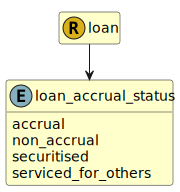

&lt;&nbsp; [Namespace](index.md)
#  fire.model.loan_accrual_status
>  
>The accrual status of the loan or line of credit.
> 

## Local Fields

| Name        | Description |
| ----------- | ----------- |
| accrual |   |
| non_accrual |   |
| securitised |   |
| serviced_for_others |   |

 

### Referenced from fields in:
-  [fire.model.loan](UDT-fire.model.loan.md)
