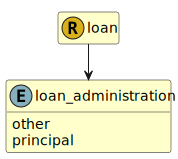

&lt;&nbsp; [Namespace](index.md)
#  fire.model.loan_administration
>  
>How the loan was administered by the lender.
> 

## Local Fields

| Name        | Description |
| ----------- | ----------- |
| other |   |
| principal |   |

 

### Referenced from fields in:
-  [fire.model.loan](UDT-fire.model.loan.md)
