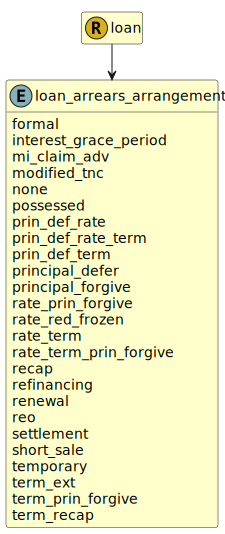

&lt;&nbsp; [Namespace](index.md)
#  fire.model.loan_arrears_arrangement
>  
>The arrangement the lender has made with the borrower regarding the amount referenced in the arrears_balance.
> 

## Local Fields

| Name        | Description |
| ----------- | ----------- |
| formal |   |
| interest_grace_period |   |
| modified_tnc |   |
| none |   |
| possessed |   |
| refinancing |   |
| temporary |   |

 

### Referenced from fields in:
-  [fire.model.loan](UDT-fire.model.loan.md)
