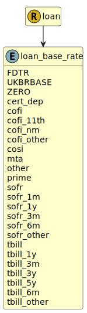

&lt;&nbsp; [Namespace](index.md)
#  fire.model.loan_base_rate
>  
>The base rate represents the basis of the repayment rate on the borrowed funds at the given date as agreed in the terms of the loan.
> 

## Local Fields

| Name        | Description |
| ----------- | ----------- |
| FDTR |   |
| UKBRBASE |   |
| ZERO |   |

 

### Referenced from fields in:
-  [fire.model.loan](UDT-fire.model.loan.md)
