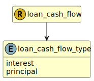

&lt;&nbsp; [Namespace](index.md)
#  fire.model.loan_cash_flow_type
>  
>The type of the payment, signifying whether interest or principal is being paid.
> 

## Local Fields

| Name        | Description |
| ----------- | ----------- |
| interest |   |
| principal |   |

 

### Referenced from fields in:
-  [fire.model.loan_cash_flow](UDT-fire.model.loan_cash_flow.md)
