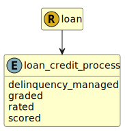

&lt;&nbsp; [Namespace](index.md)
#  fire.model.loan_credit_process
>  
>Identifier for how a loan is credit assessed during the underwriting process
> 

## Local Fields

| Name        | Description |
| ----------- | ----------- |
| delinquency_managed |   |
| graded |   |
| rated |   |
| scored |   |

 

### Referenced from fields in:
-  [fire.model.loan](UDT-fire.model.loan.md)
