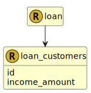

&lt;&nbsp; [Namespace](index.md)
#  fire.model.loan_customers

## Local Fields

<table >
  <thead>
    <tr>
      <th>Name</th>
      <th>Datatype</th>
      <th>Description</th>
    </tr>
  </thead>
  <tbody>
    <tr>
        <td>id</td>
        <td>string</td>
        <td>
The unique identifier for the customer/s within the financial institution.

</td>
    </tr>
    <tr>
        <td>income_amount</td>
        <td>int(0, *)</td>
        <td>
The reference income used for the customer(s) for this loan. Monetary type represented as an integer number of cents/pence.

</td>
    </tr>

  </tbody>
</table>
      

 

### Referenced from fields in:
-  [fire.model.loan](UDT-fire.model.loan.md)
