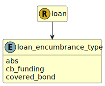

&lt;&nbsp; [Namespace](index.md)
#  fire.model.loan_encumbrance_type
>  
>The type of the encumbrance causing the encumbrance_amount.
> 

## Local Fields

| Name        | Description |
| ----------- | ----------- |
| abs |   |
| cb_funding |   |
| covered_bond |   |

 

### Referenced from fields in:
-  [fire.model.loan](UDT-fire.model.loan.md)
