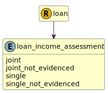

&lt;&nbsp; [Namespace](index.md)
#  fire.model.loan_income_assessment
>  
>Was the loan assessed against a single or joint incomes?
> 

## Local Fields

| Name        | Description |
| ----------- | ----------- |
| joint |   |
| joint_not_evidenced |   |
| single |   |
| single_not_evidenced |   |

 

### Referenced from fields in:
-  [fire.model.loan](UDT-fire.model.loan.md)
