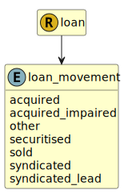

&lt;&nbsp; [Namespace](index.md)
#  fire.model.loan_movement
>  
>The movement parameter describes how the loan arrived to the firm.
> 

## Local Fields

| Name        | Description |
| ----------- | ----------- |
| acquired |   |
| acquired_impaired |   |
| other |   |
| securitised |   |
| sold |   |
| syndicated |   |
| syndicated_lead |   |

 

### Referenced from fields in:
-  [fire.model.loan](UDT-fire.model.loan.md)
