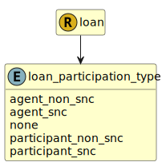

&lt;&nbsp; [Namespace](index.md)
#  fire.model.loan_participation_type
>  
>For participated or syndicated credit facilities that have closed and settled, indicates the type of participation in the loan. Refer to https://www.federalreserve.gov/apps/reportingforms/Report/Index/FR_Y-14Q for more information.
> 

## Local Fields

| Name        | Description |
| ----------- | ----------- |
| agent_non_snc |   |
| agent_snc |   |
| none |   |
| participant_non_snc |   |
| participant_snc |   |

 

### Referenced from fields in:
-  [fire.model.loan](UDT-fire.model.loan.md)
