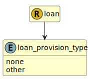

&lt;&nbsp; [Namespace](index.md)
#  fire.model.loan_provision_type
>  
>The provision type parameter details the provisions the issuing firm has allocated to cover potential losses from issuing a loan.
> 

## Local Fields

| Name        | Description |
| ----------- | ----------- |
| none |   |
| other |   |

 

### Referenced from fields in:
-  [fire.model.loan](UDT-fire.model.loan.md)
