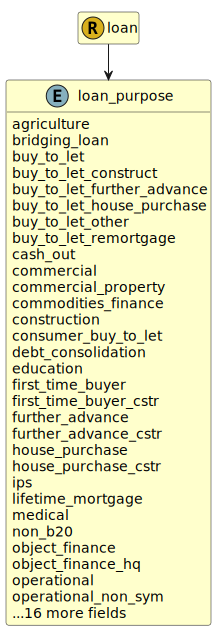

&lt;&nbsp; [Namespace](index.md)
#  fire.model.loan_purpose
>  
>The underlying reason the borrower has requested the loan.
> 

## Local Fields

| Name        | Description |
| ----------- | ----------- |
| agriculture |   |
| bridging_loan |   |
| buy_to_let |   |
| buy_to_let_construct |   |
| buy_to_let_further_advance |   |
| buy_to_let_house_purchase |   |
| buy_to_let_other |   |
| buy_to_let_remortgage |   |
| commodities_finance |   |
| construction |   |
| consumer_buy_to_let |   |
| econ_loss_retail |   |
| econ_loss_wholesale |   |
| first_time_buyer |   |
| first_time_buyer_cstr |   |
| fraud_loss_retail |   |
| further_advance |   |
| further_advance_cstr |   |
| house_purchase |   |
| house_purchase_cstr |   |
| ips |   |
| lifetime_mortgage |   |
| non_b20 |   |
| object_finance |   |
| object_finance_hq |   |
| operational |   |
| other |   |
| project_finance |   |
| project_hq_phase |   |
| project_pre_op |   |
| promotional |   |
| reference |   |
| remortgage |   |
| remortgage_construct |   |
| remortgage_other |   |
| remortgage_othr_cstr |   |
| speculative_property |   |

 

### Referenced from fields in:
-  [fire.model.loan](UDT-fire.model.loan.md)
