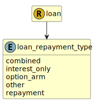

&lt;&nbsp; [Namespace](index.md)
#  fire.model.loan_repayment_type
>  
>Repayment type of the loan refers to whether the customer will be repaying capital + interest, just interest or a combination of the two.
> 

## Local Fields

| Name        | Description |
| ----------- | ----------- |
| combined |   |
| interest_only |   |
| option_arm |   |
| other |   |
| repayment |   |

 

### Referenced from fields in:
-  [fire.model.loan](UDT-fire.model.loan.md)
