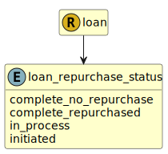

&lt;&nbsp; [Namespace](index.md)
#  fire.model.loan_repurchase_status
>  
>The current status of the repurchase of the loan.
> 

## Local Fields

| Name        | Description |
| ----------- | ----------- |
| complete_no_repurchase |   |
| complete_repurchased |   |
| in_process |   |
| initiated |   |

 

### Referenced from fields in:
-  [fire.model.loan](UDT-fire.model.loan.md)
