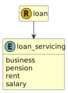

&lt;&nbsp; [Namespace](index.md)
#  fire.model.loan_servicing
>  
>The method by which the loan shall be repaid
> 

## Local Fields

| Name        | Description |
| ----------- | ----------- |
| business |   |
| pension |   |
| rent |   |
| salary |   |

 

### Referenced from fields in:
-  [fire.model.loan](UDT-fire.model.loan.md)
