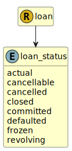

&lt;&nbsp; [Namespace](index.md)
#  fire.model.loan_status
>  
>Describes if the loan is active or been cancelled.
> 

## Local Fields

| Name        | Description |
| ----------- | ----------- |
| actual |   |
| cancellable |   |
| cancelled |   |
| committed |   |
| defaulted |   |
| revolving |   |

 

### Referenced from fields in:
-  [fire.model.loan](UDT-fire.model.loan.md)
