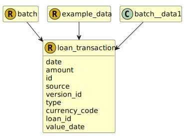

&lt;&nbsp; [Namespace](index.md)
#  fire.model.loan_transaction
>  
>A Loan Transaction is an event that has an impact on a loan, typically the balance.
> 

## Local Fields

<table >
  <thead>
    <tr>
      <th>Name</th>
      <th>Datatype</th>
      <th>Description</th>
    </tr>
  </thead>
  <tbody>
    <tr>
        <td>date</td>
        <td>datetime</td>
        <td>
The observation or value date for the data in this object. Formatted as YYYY-MM-DDTHH:MM:SSZ in accordance with ISO 8601.

</td>
    </tr>
    <tr>
        <td>amount</td>
        <td>int</td>
        <td>
The size of the transaction in the loan transaction event. Monetary type represented as a naturally positive integer number of cents/pence.

</td>
    </tr>
    <tr>
        <td>id</td>
        <td>string</td>
        <td>
The unique identifier for the record within the firm.

</td>
    </tr>
    <tr>
        <td>source</td>
        <td><i>string</i> <b>?</b></td>
        <td>
The source(s) where this data originated. If more than one source needs to be stored for data lineage, it should be separated by a dash. eg. Source1-Source2

</td>
    </tr>
    <tr>
        <td>version_id</td>
        <td><i>string</i> <b>?</b></td>
        <td>
The version identifier of the data such as the firm's internal batch identifier.

</td>
    </tr>
    <tr>
        <td>type</td>
        <td><i><a href='UDT-fire.model.loan_transaction_type.html'>&nbsp;fire.model.loan_transaction_type</a></i> <b>?</b></td>
        <td>
The type of impact on the balance of the loan.

</td>
    </tr>
    <tr>
        <td>currency_code</td>
        <td><i><a href='UDT-fire.model.currency_code.html'>&nbsp;fire.model.currency_code</a></i> <b>?</b></td>
        <td></td>
    </tr>
    <tr>
        <td>loan_id</td>
        <td>string</td>
        <td>
The unique identifier for the affected loan/s within the financial institution.

</td>
    </tr>
    <tr>
        <td>value_date</td>
        <td><i>datetime</i> <b>?</b></td>
        <td>
The timestamp that the transaction was valued or took place. YYYY-MM-DDTHH:MM:SSZ in accordance with ISO 8601.

</td>
    </tr>

  </tbody>
</table>
      

 

### Referenced from fields in:
-  [fire.model.batch](UDT-fire.model.batch.md)
-  [fire.model.example_data](UDT-fire.model.example_data.md)
