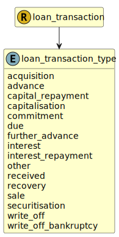

&lt;&nbsp; [Namespace](index.md)
#  fire.model.loan_transaction_type
>  
>The type of impact on the balance of the loan.
> 

## Local Fields

| Name        | Description |
| ----------- | ----------- |
| acquisition |   |
| advance |   |
| capital_repayment |   |
| capitalisation |   |
| due |   |
| further_advance |   |
| interest |   |
| interest_repayment |   |
| other |   |
| received |   |
| sale |   |
| securitisation |   |
| write_off |   |

 

### Referenced from fields in:
-  [fire.model.loan_transaction](UDT-fire.model.loan_transaction.md)
