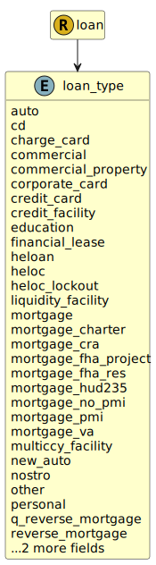

&lt;&nbsp; [Namespace](index.md)
#  fire.model.loan_type
>  
>The form of the loan product administered by the financial institution, with regards to common regulatory classifications.
> 

## Local Fields

| Name        | Description |
| ----------- | ----------- |
| auto |   |
| cd |   |
| charge_card |   |
| commercial |   |
| commercial_property |   |
| corporate_card |   |
| credit_card |   |
| credit_facility |   |
| education |   |
| financial_lease |   |
| heloc |   |
| liquidity_facility |   |
| mortgage |   |
| mortgage_charter |   |
| multiccy_facility |   |
| new_auto |   |
| nostro |   |
| other |   |
| personal |   |
| q_reverse_mortgage |   |
| reverse_mortgage |   |
| trade_finance |   |
| used_auto |   |

 

### Referenced from fields in:
-  [fire.model.loan](UDT-fire.model.loan.md)
