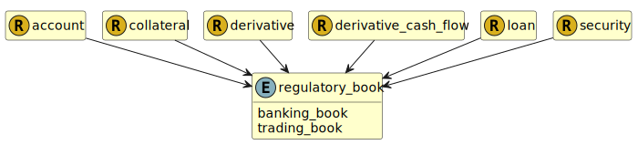

&lt;&nbsp; [Namespace](index.md)
#  fire.model.regulatory_book
>  
>The type of portfolio in which the instrument is held.
> 

## Local Fields

| Name        | Description |
| ----------- | ----------- |
| banking_book |   |
| trading_book |   |

 

### Referenced from fields in:
-  [fire.model.account](UDT-fire.model.account.md)
-  [fire.model.collateral](UDT-fire.model.collateral.md)
-  [fire.model.derivative](UDT-fire.model.derivative.md)
-  [fire.model.derivative_cash_flow](UDT-fire.model.derivative_cash_flow.md)
-  [fire.model.loan](UDT-fire.model.loan.md)
-  [fire.model.security](UDT-fire.model.security.md)
