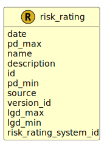

&lt;&nbsp; [Namespace](index.md)
#  fire.model.risk_rating
>  
>A risk rating entry for a risk rating system
> 

## Local Fields

<table >
  <thead>
    <tr>
      <th>Name</th>
      <th>Datatype</th>
      <th>Description</th>
    </tr>
  </thead>
  <tbody>
    <tr>
        <td>date</td>
        <td>datetime</td>
        <td>
The observation or value date for the data in this object. Formatted as YYYY-MM-DDTHH:MM:SSZ in accordance with ISO 8601.

</td>
    </tr>
    <tr>
        <td>pd_max</td>
        <td><i>double(0.0, 1.0)</i> <b>?</b></td>
        <td>
Maximum Probability of Default

</td>
    </tr>
    <tr>
        <td>name</td>
        <td>string</td>
        <td>
The name or classification of the risk rating, used for reporting and segmentation.

</td>
    </tr>
    <tr>
        <td>description</td>
        <td><i>string</i> <b>?</b></td>
        <td>
A description of the internal risk rating.

</td>
    </tr>
    <tr>
        <td>id</td>
        <td>string</td>
        <td>
Unique identifier for the risk rating

</td>
    </tr>
    <tr>
        <td>pd_min</td>
        <td><i>double(0.0, 1.0)</i> <b>?</b></td>
        <td>
Minimum Probability of Default

</td>
    </tr>
    <tr>
        <td>source</td>
        <td><i>string</i> <b>?</b></td>
        <td>
The source where this data originated.

</td>
    </tr>
    <tr>
        <td>version_id</td>
        <td><i>string</i> <b>?</b></td>
        <td>
The version identifier of the data such as the firm's internal batch identifier.

</td>
    </tr>
    <tr>
        <td>lgd_max</td>
        <td><i>double(0.0, 1.0)</i> <b>?</b></td>
        <td>
Maximum Loss Given Default, representing the highest expected loss as a percentage of exposure at default.

</td>
    </tr>
    <tr>
        <td>lgd_min</td>
        <td><i>double(0.0, 1.0)</i> <b>?</b></td>
        <td>
Minimum Loss Given Default, representing the lowest expected loss as a percentage of exposure at default.

</td>
    </tr>
    <tr>
        <td>risk_rating_system_id</td>
        <td>string</td>
        <td>
Reference to the risk rating system that this Internal Risk Rating belongs to

</td>
    </tr>

  </tbody>
</table>
      
