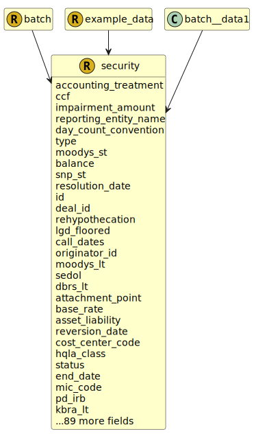

&lt;&nbsp; [Namespace](index.md)
#  fire.model.security
>  
>A security represents a tradable financial instrument held or financed by an institution for investment or collateral.
> 

## Local Fields

<table >
  <thead>
    <tr>
      <th>Name</th>
      <th>Datatype</th>
      <th>Description</th>
    </tr>
  </thead>
  <tbody>
    <tr>
        <td>accounting_treatment</td>
        <td><i><a href='UDT-fire.model.accounting_treatment.html'>&nbsp;fire.model.accounting_treatment</a></i> <b>?</b></td>
        <td></td>
    </tr>
    <tr>
        <td>ccf</td>
        <td><i>double(0.0, *)</i> <b>?</b></td>
        <td></td>
    </tr>
    <tr>
        <td>impairment_amount</td>
        <td><i>int(0, *)</i> <b>?</b></td>
        <td>
The impairment amount for a security is the allowance set aside by the firm for losses.

</td>
    </tr>
    <tr>
        <td>reporting_entity_name</td>
        <td><i>string</i> <b>?</b></td>
        <td>
The name of the reporting legal entity for display purposes.

</td>
    </tr>
    <tr>
        <td>day_count_convention</td>
        <td><i><a href='UDT-fire.model.day_count_convention.html'>&nbsp;fire.model.day_count_convention</a></i> <b>?</b></td>
        <td>
The standardised methodology for calculating the number of days between two dates. It is used to calculate the amount of accrued interest or the present value.

</td>
    </tr>
    <tr>
        <td>type</td>
        <td><i><a href='UDT-fire.model.security_type.html'>&nbsp;fire.model.security_type</a></i> <b>?</b></td>
        <td>
This is the type of the security with regards to common regulatory classifications.

</td>
    </tr>
    <tr>
        <td>moodys_st</td>
        <td><i><a href='UDT-fire.model.security_moodys_st.html'>&nbsp;fire.model.security_moodys_st</a></i> <b>?</b></td>
        <td>
Moodys short term credit ratings

</td>
    </tr>
    <tr>
        <td>balance</td>
        <td><i>int</i> <b>?</b></td>
        <td>
Outstanding amount including accrued interest. Monetary integer number of cents/pence.

</td>
    </tr>
    <tr>
        <td>snp_st</td>
        <td><i><a href='UDT-fire.model.security_snp_st.html'>&nbsp;fire.model.security_snp_st</a></i> <b>?</b></td>
        <td>
S&amp;P short term credit ratings

</td>
    </tr>
    <tr>
        <td>id</td>
        <td>string</td>
        <td>
The unique identifier for the record within the firm.

</td>
    </tr>
    <tr>
        <td>deal_id</td>
        <td><i>string</i> <b>?</b></td>
        <td>
The unique identifier used by the financial institution to identify the deal for this product that links it to other products of the same or different type.

</td>
    </tr>
    <tr>
        <td>rehypothecation</td>
        <td><i>boolean</i> <b>?</b></td>
        <td>
Can the security be rehypothecated by the borrower?

</td>
    </tr>
    <tr>
        <td>lgd_floored</td>
        <td><i>double(0.0, 1.0)</i> <b>?</b></td>
        <td>
The final LGD value after the relevant floors have been applied. To be used in the IRB RWA calculations.

</td>
    </tr>
    <tr>
        <td>call_dates</td>
        <td><i>list< datetime ></i> <b>?</b></td>
        <td>
Dates where this contract can be called (by the customer). Formatted as YYYY-MM-DDTHH:MM:SSZ in accordance with ISO 8601.

</td>
    </tr>
    <tr>
        <td>originator_id</td>
        <td><i>string</i> <b>?</b></td>
        <td>
The unique identifier used by the financial institution to identify the originator of the security or securitisation.

</td>
    </tr>
    <tr>
        <td>moodys_lt</td>
        <td><i><a href='UDT-fire.model.security_moodys_lt.html'>&nbsp;fire.model.security_moodys_lt</a></i> <b>?</b></td>
        <td>
Moody's long term credit ratings

</td>
    </tr>
    <tr>
        <td>dbrs_lt</td>
        <td><i><a href='UDT-fire.model.security_dbrs_lt.html'>&nbsp;fire.model.security_dbrs_lt</a></i> <b>?</b></td>
        <td>
DBRS long term credit ratings

</td>
    </tr>
    <tr>
        <td>attachment_point</td>
        <td><i>double(0.0, 1.0)</i> <b>?</b></td>
        <td>
The threshold at which losses within the pool of underlying exposures would start to be allocated to the relevant securitisation position.

</td>
    </tr>
    <tr>
        <td>base_rate</td>
        <td><i><a href='UDT-fire.model.security_base_rate.html'>&nbsp;fire.model.security_base_rate</a></i> <b>?</b></td>
        <td>
The base rate represents the basis of the rate on the balance at the given date as agreed in the terms of the financial product.

</td>
    </tr>
    <tr>
        <td>asset_liability</td>
        <td><i><a href='UDT-fire.model.asset_liability.html'>&nbsp;fire.model.asset_liability</a></i> <b>?</b></td>
        <td>
Is the security (valued at either amortised cost or fair value) an asset or a liability on the firm's balance sheet.

</td>
    </tr>
    <tr>
        <td>reversion_date</td>
        <td><i>datetime</i> <b>?</b></td>
        <td>
The timestamp that indicates the end of an initial period where the 'rate' is applied to a security. After this the interest is calculated using the 'reversion_rate'. YYYY-MM-DDTHH:MM:SSZ in accordance with ISO 8601.

</td>
    </tr>
    <tr>
        <td>cost_center_code</td>
        <td><i>string</i> <b>?</b></td>
        <td>
The organizational unit or sub-unit to which costs/profits are booked.

</td>
    </tr>
    <tr>
        <td>hqla_class</td>
        <td><i><a href='UDT-fire.model.security_hqla_class.html'>&nbsp;fire.model.security_hqla_class</a></i> <b>?</b></td>
        <td>
What is the HQLA classification of this security?

</td>
    </tr>
    <tr>
        <td>status</td>
        <td><i><a href='UDT-fire.model.security_status.html'>&nbsp;fire.model.security_status</a></i> <b>?</b></td>
        <td>
Provides additional information regarding the status of the security.

</td>
    </tr>
    <tr>
        <td>end_date</td>
        <td><i>datetime</i> <b>?</b></td>
        <td>
YYYY-MM-DDTHH:MM:SSZ in accordance with ISO 8601

</td>
    </tr>
    <tr>
        <td>mic_code</td>
        <td><i>string(4, 4)</i> <b>?</b></td>
        <td></td>
    </tr>
    <tr>
        <td>pd_irb</td>
        <td><i>double(0.0, 1.0)</i> <b>?</b></td>
        <td>
The probability of default as determined by internal rating-based methods, represented as a number between 0 and 1.

</td>
    </tr>
    <tr>
        <td>kbra_lt</td>
        <td><i><a href='UDT-fire.model.security_kbra_lt.html'>&nbsp;fire.model.security_kbra_lt</a></i> <b>?</b></td>
        <td>
KBRA long term credit ratings

</td>
    </tr>
    <tr>
        <td>interest_repayment_frequency</td>
        <td><i><a href='UDT-fire.model.security_interest_repayment_frequency.html'>&nbsp;fire.model.security_interest_repayment_frequency</a></i> <b>?</b></td>
        <td>
Repayment frequency of the interest.

</td>
    </tr>
    <tr>
        <td>notional_amount</td>
        <td><i>int</i> <b>?</b></td>
        <td>
The notional value is the total amount of a security's underlying asset at its spot price. Monetary number of cents.

</td>
    </tr>
    <tr>
        <td>regulatory_book</td>
        <td><i><a href='UDT-fire.model.regulatory_book.html'>&nbsp;fire.model.regulatory_book</a></i> <b>?</b></td>
        <td></td>
    </tr>
    <tr>
        <td>guarantee_start_date</td>
        <td><i>datetime</i> <b>?</b></td>
        <td>
The first day the security became guaranteed by the guarantor. YYYY-MM-DDTHH:MM:SSZ in accordance with ISO 8601

</td>
    </tr>
    <tr>
        <td>risk_weight_irb</td>
        <td><i>double</i> <b>?</b></td>
        <td>
The internal risk weight represented as a decimal/float such that 1.5% is 0.015.

</td>
    </tr>
    <tr>
        <td>currency_code</td>
        <td><i><a href='UDT-fire.model.currency_code.html'>&nbsp;fire.model.currency_code</a></i> <b>?</b></td>
        <td>
Actual currency of the security in accordance with ISO 4217 standards. It should be consistent with balance, accrued_interest, guarantee_amount and other monetary amounts.

</td>
    </tr>
    <tr>
        <td>repayment_type</td>
        <td><i><a href='UDT-fire.model.security_repayment_type.html'>&nbsp;fire.model.security_repayment_type</a></i> <b>?</b></td>
        <td>
The repayment or amortisation mechanism of the security or securitisation.

</td>
    </tr>
    <tr>
        <td>on_balance_sheet</td>
        <td><i>boolean</i> <b>?</b></td>
        <td>
Is the security reported on the balance sheet of the financial institution?

</td>
    </tr>
    <tr>
        <td>issue_date</td>
        <td><i>datetime</i> <b>?</b></td>
        <td>
The date on which the security is issued. YYYY-MM-DDTHH:MM:SSZ in accordance with ISO 8601.

</td>
    </tr>
    <tr>
        <td>insolvency_rank</td>
        <td><i>int(1, *)</i> <b>?</b></td>
        <td>
The insolvency ranking as per the national legal fraamework of the reporting institution.

</td>
    </tr>
    <tr>
        <td>cr_approach</td>
        <td><i><a href='UDT-fire.model.cr_approach.html'>&nbsp;fire.model.cr_approach</a></i> <b>?</b></td>
        <td>
Specifies the approved credit risk rwa calculation approach to be applied to the exposure.

</td>
    </tr>
    <tr>
        <td>csa_id</td>
        <td><i>string</i> <b>?</b></td>
        <td>
The unique identifier of the credit support annex this security falls under. Typically where used as derivatives collateral.

</td>
    </tr>
    <tr>
        <td>index_composition</td>
        <td><i>set< <a href='UDT-fire.model.security_index_composition.html'>&nbsp;fire.model.security_index_composition</a> ></i> <b>?</b></td>
        <td>
Constituents and their proportion in an index.

</td>
    </tr>
    <tr>
        <td>cqs_standardised</td>
        <td><i>int(1, 17)</i> <b>?</b></td>
        <td>
The credit quality step for standardised approach.

</td>
    </tr>
    <tr>
        <td>forbearance_date</td>
        <td><i>datetime</i> <b>?</b></td>
        <td>
The date on which the first forbearance measure was granted to this product.  Format should be YYYY-MM-DDTHH:MM:SSZ in accordance with ISO 8601

</td>
    </tr>
    <tr>
        <td>detachment_point</td>
        <td><i>double(0.0, 1.0)</i> <b>?</b></td>
        <td>
The threshold at which losses within the pool of underlying exposures would result in a complete loss of principal for the tranche containing the relevant securitisation position.

</td>
    </tr>
    <tr>
        <td>start_date</td>
        <td><i>datetime</i> <b>?</b></td>
        <td>
The timestamp that the trade or financial product commences. YYYY-MM-DDTHH:MM:SSZ in accordance with ISO 8601.

</td>
    </tr>
    <tr>
        <td>impairment_date</td>
        <td><i>datetime</i> <b>?</b></td>
        <td>
The date upon which the product became considered impaired. Format should be YYYY-MM-DDTHH:MM:SSZ in accordance with ISO 8601

</td>
    </tr>
    <tr>
        <td>trade_date</td>
        <td><i>datetime</i> <b>?</b></td>
        <td>
The timestamp that the trade or financial product terms are agreed. YYYY-MM-DDTHH:MM:SSZ in accordance with ISO 8601.

</td>
    </tr>
    <tr>
        <td>issuer_id</td>
        <td><i>string</i> <b>?</b></td>
        <td>
The unique identifier for the issuer within the financial institution.

</td>
    </tr>
    <tr>
        <td>cover_pool_balance</td>
        <td><i>int(0, *)</i> <b>?</b></td>
        <td>
The balance of the assets that are held in the cover pool

</td>
    </tr>
    <tr>
        <td>cb_haircut</td>
        <td><i>double(0.0, 1.0)</i> <b>?</b></td>
        <td>
The haircut as determined by the firm's central bank

</td>
    </tr>
    <tr>
        <td>first_arrears_date</td>
        <td><i>datetime</i> <b>?</b></td>
        <td>
The first date on which this security was in arrears.

</td>
    </tr>
    <tr>
        <td>accrued_interest</td>
        <td><i>int</i> <b>?</b></td>
        <td>
The accrued interest since the last payment date and due at the next payment date. Monetary type represented as an integer number of cents/pence.

</td>
    </tr>
    <tr>
        <td>customer_id</td>
        <td><i>string</i> <b>?</b></td>
        <td>
The unique identifier used by the financial institution to identify the customer for this product.

</td>
    </tr>
    <tr>
        <td>movement</td>
        <td><i><a href='UDT-fire.model.security_movement.html'>&nbsp;fire.model.security_movement</a></i> <b>?</b></td>
        <td>
The movement parameter describes how the security arrived to the firm.

</td>
    </tr>
    <tr>
        <td>seniority</td>
        <td><i><a href='UDT-fire.model.security_seniority.html'>&nbsp;fire.model.security_seniority</a></i> <b>?</b></td>
        <td>
The seniority of the security in the event of sale or bankruptcy of the issuer.

</td>
    </tr>
    <tr>
        <td>sft_type</td>
        <td><i><a href='UDT-fire.model.security_sft_type.html'>&nbsp;fire.model.security_sft_type</a></i> <b>?</b></td>
        <td>
The sft_type parameter defines the transaction mechanism conducted for the SFT for this security product.

</td>
    </tr>
    <tr>
        <td>value_date</td>
        <td><i>datetime</i> <b>?</b></td>
        <td>
The timestamp that the trade or financial product was valued. YYYY-MM-DDTHH:MM:SSZ in accordance with ISO 8601.

</td>
    </tr>
    <tr>
        <td>date</td>
        <td>datetime</td>
        <td>
The observation or value date for the data in this object. Formatted as YYYY-MM-DDTHH:MM:SSZ in accordance with ISO 8601.

</td>
    </tr>
    <tr>
        <td>cqs_irb</td>
        <td><i>int(1, 12)</i> <b>?</b></td>
        <td>
The credit quality step for internal ratings based approach.

</td>
    </tr>
    <tr>
        <td>risk_weight_std</td>
        <td><i>double</i> <b>?</b></td>
        <td>
The standardised approach risk weight represented as a decimal/float such that 1.5% is 0.015.

</td>
    </tr>
    <tr>
        <td>securitisation_type</td>
        <td><i><a href='UDT-fire.model.security_securitisation_type.html'>&nbsp;fire.model.security_securitisation_type</a></i> <b>?</b></td>
        <td>
The type of securitisation with regards to common regulatory classifications.

</td>
    </tr>
    <tr>
        <td>mtm_clean</td>
        <td><i>int</i> <b>?</b></td>
        <td>
The mark-to-market value of the security excluding interest. Monetary number of cents/pence.

</td>
    </tr>
    <tr>
        <td>impairment_status</td>
        <td><i><a href='UDT-fire.model.impairment_status.html'>&nbsp;fire.model.impairment_status</a></i> <b>?</b></td>
        <td></td>
    </tr>
    <tr>
        <td>transferable</td>
        <td><i>boolean</i> <b>?</b></td>
        <td>
Can the security be transferred between parties or negotiated on the capital market?

</td>
    </tr>
    <tr>
        <td>source</td>
        <td><i>string</i> <b>?</b></td>
        <td>
The source(s) where this data originated. If more than one source needs to be stored for data lineage, it should be separated by a dash. eg. Source1-Source2

</td>
    </tr>
    <tr>
        <td>fitch_lt</td>
        <td><i><a href='UDT-fire.model.security_fitch_lt.html'>&nbsp;fire.model.security_fitch_lt</a></i> <b>?</b></td>
        <td>
Fitch long term credit ratings

</td>
    </tr>
    <tr>
        <td>kbra_st</td>
        <td><i><a href='UDT-fire.model.security_kbra_st.html'>&nbsp;fire.model.security_kbra_st</a></i> <b>?</b></td>
        <td>
KBRA short term credit ratings

</td>
    </tr>
    <tr>
        <td>ledger_code</td>
        <td><i>string</i> <b>?</b></td>
        <td>
The internal ledger code or line item name.

</td>
    </tr>
    <tr>
        <td>isin_code</td>
        <td><i>string(12, 12)</i> <b>?</b></td>
        <td>
The unique International Securities Identification Number for the security according to ISO 6166.

</td>
    </tr>
    <tr>
        <td>issue_size</td>
        <td><i>int</i> <b>?</b></td>
        <td>
The size of the issue denominated in the original currency of the security

</td>
    </tr>
    <tr>
        <td>risk_profile</td>
        <td><i>int(1, 10)</i> <b>?</b></td>
        <td>
The evaluation of the financial risk associated to the portfolio

</td>
    </tr>
    <tr>
        <td>last_payment_date</td>
        <td><i>datetime</i> <b>?</b></td>
        <td>
The final payment date for interest payments, often coincides with end_date or the maturity date

</td>
    </tr>
    <tr>
        <td>product_name</td>
        <td><i>string</i> <b>?</b></td>
        <td>
The name of the product as given by the financial institution to be used for display and reference purposes.

</td>
    </tr>
    <tr>
        <td>excess_spread_type</td>
        <td><i><a href='UDT-fire.model.security_excess_spread_type.html'>&nbsp;fire.model.security_excess_spread_type</a></i> <b>?</b></td>
        <td>
Excess spread

</td>
    </tr>
    <tr>
        <td>retention_type</td>
        <td><i><a href='UDT-fire.model.security_retention_type.html'>&nbsp;fire.model.security_retention_type</a></i> <b>?</b></td>
        <td>
The repayment or amortisation mechanism of the security or securitisation.

</td>
    </tr>
    <tr>
        <td>country_code</td>
        <td><i><a href='UDT-fire.model.country_code.html'>&nbsp;fire.model.country_code</a></i> <b>?</b></td>
        <td>
Two-letter country code for security location/jurisdiction. In accordance with ISO 3166-1.

</td>
    </tr>
    <tr>
        <td>fitch_st</td>
        <td><i><a href='UDT-fire.model.security_fitch_st.html'>&nbsp;fire.model.security_fitch_st</a></i> <b>?</b></td>
        <td>
Fitch short term credit ratings

</td>
    </tr>
    <tr>
        <td>first_payment_date</td>
        <td><i>datetime</i> <b>?</b></td>
        <td>
The first payment date for interest payments.

</td>
    </tr>
    <tr>
        <td>guarantor_id</td>
        <td><i>string</i> <b>?</b></td>
        <td>
The unique identifier for the guarantor within the financial institution.

</td>
    </tr>
    <tr>
        <td>reversion_rate</td>
        <td><i>double</i> <b>?</b></td>
        <td>
The rate to which the security will revert after the reversion date. Percentages represented as a decimal/float, so 1.5 implies 1.5%.

</td>
    </tr>
    <tr>
        <td>stress_change</td>
        <td><i>double(0.0, *)</i> <b>?</b></td>
        <td>
The level of variation on the security's price or haircut or during a 30 day calendar market stress period in percentage terms

</td>
    </tr>
    <tr>
        <td>purpose</td>
        <td><i><a href='UDT-fire.model.security_purpose.html'>&nbsp;fire.model.security_purpose</a></i> <b>?</b></td>
        <td>
The purpose for which the security is being held.

</td>
    </tr>
    <tr>
        <td>risk_country_code</td>
        <td><i><a href='UDT-fire.model.country_code.html'>&nbsp;fire.model.country_code</a></i> <b>?</b></td>
        <td>
Two-letter country code describing where the risk for the security resides. In accordance with ISO 3166-1

</td>
    </tr>
    <tr>
        <td>dbrs_st</td>
        <td><i><a href='UDT-fire.model.security_dbrs_st.html'>&nbsp;fire.model.security_dbrs_st</a></i> <b>?</b></td>
        <td>
DBRS short term credit ratings

</td>
    </tr>
    <tr>
        <td>fvh_level</td>
        <td><i>int(1, 3)</i> <b>?</b></td>
        <td>
Fair value hierarchy category according to IFRS 13.93 (b)

</td>
    </tr>
    <tr>
        <td>maturity_date</td>
        <td><i>datetime</i> <b>?</b></td>
        <td>
The date on which the principal repayment of the security is due. YYYY-MM-DDTHH:MM:SSZ in accordance with ISO 8601.

</td>
    </tr>
    <tr>
        <td>retention_pct</td>
        <td><i>double</i> <b>?</b></td>
        <td>
The percentage of the issuance retained by the issuer. e.g. 0.05 is 5%.

</td>
    </tr>
    <tr>
        <td>next_payment_date</td>
        <td><i>datetime</i> <b>?</b></td>
        <td>
The next date at which interest will be paid or accrued_interest balance returned to zero.

</td>
    </tr>
    <tr>
        <td>rate</td>
        <td><i>double</i> <b>?</b></td>
        <td>
The full interest rate applied to the security notional in percentage terms. Note that this therefore includes the base_rate (ie. not the spread).

</td>
    </tr>
    <tr>
        <td>capital_tier</td>
        <td><i><a href='UDT-fire.model.security_capital_tier.html'>&nbsp;fire.model.security_capital_tier</a></i> <b>?</b></td>
        <td>
The capital tiers based on own funds requirements.

</td>
    </tr>
    <tr>
        <td>ccr_approach</td>
        <td><i><a href='UDT-fire.model.security_ccr_approach.html'>&nbsp;fire.model.security_ccr_approach</a></i> <b>?</b></td>
        <td>
Specifies the approved counterparty credit risk methodology for calculating exposures.

</td>
    </tr>
    <tr>
        <td>prev_payment_date</td>
        <td><i>datetime</i> <b>?</b></td>
        <td>
The most recent previous date at which interest was paid or accrued_interest balance returned to zero.

</td>
    </tr>
    <tr>
        <td>encumbrance_amount</td>
        <td><i>int(0, *)</i> <b>?</b></td>
        <td>
The amount of the security that is encumbered by potential future commitments or legal liabilities such as within a repo pool. Monetary type represented as a naturally positive integer number of cents/pence.

</td>
    </tr>
    <tr>
        <td>break_dates</td>
        <td><i>list< datetime ></i> <b>?</b></td>
        <td>
Dates where this contract can be broken (by either party). Formatted as YYYY-MM-DDTHH:MM:SSZ in accordance with ISO 8601.

</td>
    </tr>
    <tr>
        <td>call_type</td>
        <td><i><a href='UDT-fire.model.security_call_type.html'>&nbsp;fire.model.security_call_type</a></i> <b>?</b></td>
        <td>
The call mechanism, if present, for the issuance. For securitisations and other callable securities.

</td>
    </tr>
    <tr>
        <td>mna_id</td>
        <td><i>string</i> <b>?</b></td>
        <td>
The unique identifier of the Master Netting Agreement this security falls under. Typically where used as derivatives collateral.

</td>
    </tr>
    <tr>
        <td>reporting_id</td>
        <td><i>string</i> <b>?</b></td>
        <td>
The internal ID for the legal entity under which the account is being reported.

</td>
    </tr>
    <tr>
        <td>version_id</td>
        <td><i>string</i> <b>?</b></td>
        <td>
The version identifier of the data such as the firm's internal batch identifier.

</td>
    </tr>
    <tr>
        <td>snp_lt</td>
        <td><i><a href='UDT-fire.model.security_snp_lt.html'>&nbsp;fire.model.security_snp_lt</a></i> <b>?</b></td>
        <td>
S&amp;P long term credit ratings

</td>
    </tr>
    <tr>
        <td>acc_fv_change_credit_risk</td>
        <td><i>int</i> <b>?</b></td>
        <td>
Accumulated changes in fair value due to credit risk.

</td>
    </tr>
    <tr>
        <td>lgd_irb</td>
        <td><i>double(0.0, 1.0)</i> <b>?</b></td>
        <td>
The loss given default as determined by internal rating-based methods, represented as a number between 0 and 1.

</td>
    </tr>
    <tr>
        <td>mtm_dirty</td>
        <td><i>int</i> <b>?</b></td>
        <td>
The mark-to-market value of the security including interest. Monetary number of cents/pence.

</td>
    </tr>
    <tr>
        <td>acc_fv_change_before_taxes</td>
        <td><i>int</i> <b>?</b></td>
        <td>
Accumulated change in fair value before taxes.

</td>
    </tr>
    <tr>
        <td>next_repricing_date</td>
        <td><i>datetime</i> <b>?</b></td>
        <td>
The date on which the interest rate of the security will be re-calculated. YYYY-MM-DDTHH:MM:SSZ in accordance with ISO 8601.

</td>
    </tr>

  </tbody>
</table>
      

 

### Referenced from fields in:
-  [fire.model.batch](UDT-fire.model.batch.md)
-  [fire.model.example_data](UDT-fire.model.example_data.md)
