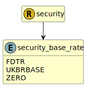

&lt;&nbsp; [Namespace](index.md)
#  fire.model.security_base_rate
>  
>The base rate represents the basis of the rate on the balance at the given date as agreed in the terms of the financial product.
> 

## Local Fields

| Name        | Description |
| ----------- | ----------- |
| FDTR |   |
| UKBRBASE |   |
| ZERO |   |
| bbsw |   |
| bbsw_3m |   |
| euribor |   |
| euribor_1m |   |
| euribor_3m |   |
| euribor_6m |   |
| other |   |
| pboc |   |
| sofr |   |
| sofr_1m |   |
| sofr_3m |   |
| sofr_6m |   |

 

### Referenced from fields in:
-  [fire.model.security](UDT-fire.model.security.md)
