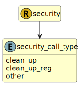

&lt;&nbsp; [Namespace](index.md)
#  fire.model.security_call_type
>  
>The call mechanism, if present, for the issuance. For securitisations and other callable securities.
> 

## Local Fields

| Name        | Description |
| ----------- | ----------- |
| clean_up |   |
| clean_up_reg |   |
| other |   |

 

### Referenced from fields in:
-  [fire.model.security](UDT-fire.model.security.md)
