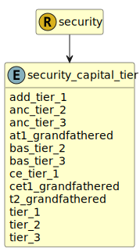

&lt;&nbsp; [Namespace](index.md)
#  fire.model.security_capital_tier
>  
>The capital tiers based on own funds requirements.
> 

## Local Fields

| Name        | Description |
| ----------- | ----------- |
| add_tier_1 |   |
| anc_tier_2 |   |
| anc_tier_3 |   |
| at1_grandfathered |   |
| bas_tier_2 |   |
| bas_tier_3 |   |
| ce_tier_1 |   |
| cet1_grandfathered |   |
| t2_grandfathered |   |
| tier_1 |   |
| tier_2 |   |
| tier_3 |   |

 

### Referenced from fields in:
-  [fire.model.security](UDT-fire.model.security.md)
