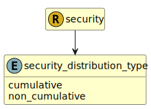

&lt;&nbsp; [Namespace](index.md)
#  fire.model.security_distribution_type
>  
>The instrument's coupon/dividend distribution type, such as cumulative or noncumulative. Refer to https://www.federalreserve.gov/apps/reportingforms/Report/Index/FR_Y-14Q for more information.
> 

## Local Fields

| Name        | Description |
| ----------- | ----------- |
| cumulative |   |
| non_cumulative |   |

 

### Referenced from fields in:
-  [fire.model.security](UDT-fire.model.security.md)
