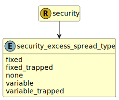

&lt;&nbsp; [Namespace](index.md)
#  fire.model.security_excess_spread_type
>  
>Excess spread
> 

## Local Fields

| Name        | Description |
| ----------- | ----------- |
| fixed |   |
| fixed_trapped |   |
| none |   |
| variable |   |
| variable_trapped |   |

 

### Referenced from fields in:
-  [fire.model.security](UDT-fire.model.security.md)
