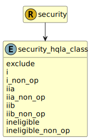

&lt;&nbsp; [Namespace](index.md)
#  fire.model.security_hqla_class
>  
>What is the HQLA classification of this security?
> 

## Local Fields

| Name        | Description |
| ----------- | ----------- |
| exclude |   |
| i |   |
| i_non_op |   |
| iia |   |
| iia_non_op |   |
| iib |   |
| iib_non_op |   |
| ineligible |   |
| ineligible_non_op |   |

 

### Referenced from fields in:
-  [fire.model.security](UDT-fire.model.security.md)
