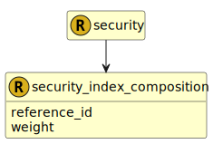

&lt;&nbsp; [Namespace](index.md)
#  fire.model.security_index_composition

## Local Fields

<table >
  <thead>
    <tr>
      <th>Name</th>
      <th>Datatype</th>
      <th>Description</th>
    </tr>
  </thead>
  <tbody>
    <tr>
        <td>reference_id</td>
        <td>string</td>
        <td>
The reference security id for the weight.

</td>
    </tr>
    <tr>
        <td>weight</td>
        <td>double(0.0, 1.0)</td>
        <td>
The proportion of the reference in the index. It is recorded in decimal format.

</td>
    </tr>

  </tbody>
</table>
      

 

### Referenced from fields in:
-  [fire.model.security](UDT-fire.model.security.md)
