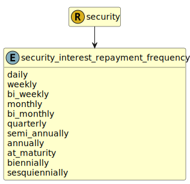

&lt;&nbsp; [Namespace](index.md)
#  fire.model.security_interest_repayment_frequency
>  
>Repayment frequency of the interest.
> 

## Local Fields

| Name        | Description |
| ----------- | ----------- |
| daily |   |
| weekly |   |
| bi_weekly |   |
| monthly |   |
| bi_monthly |   |
| quarterly |   |
| semi_annually |   |
| annually |   |
| at_maturity |   |
| biennially |   |
| sesquiennially |   |

 

### Referenced from fields in:
-  [fire.model.security](UDT-fire.model.security.md)
