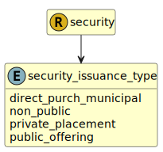

&lt;&nbsp; [Namespace](index.md)
#  fire.model.security_issuance_type
>  
>Indicates the type of placement for issuances. For example, private placements, other non-publicly offered securites, publicly offered securities or direct purchase municipal securities. Refer to https://www.federalreserve.gov/apps/reportingforms/Report/Index/FR_Y-14Q for more information.
> 

## Local Fields

| Name        | Description |
| ----------- | ----------- |
| direct_purch_municipal |   |
| non_public |   |
| private_placement |   |
| public_offering |   |

 

### Referenced from fields in:
-  [fire.model.security](UDT-fire.model.security.md)
