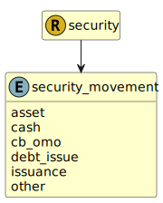

&lt;&nbsp; [Namespace](index.md)
#  fire.model.security_movement
>  
>The movement parameter describes how the security arrived to the firm.
> 

## Local Fields

| Name        | Description |
| ----------- | ----------- |
| asset |   |
| cash |   |
| cb_omo |   |
| debt_issue |   |
| issuance |   |
| other |   |

 

### Referenced from fields in:
-  [fire.model.security](UDT-fire.model.security.md)
